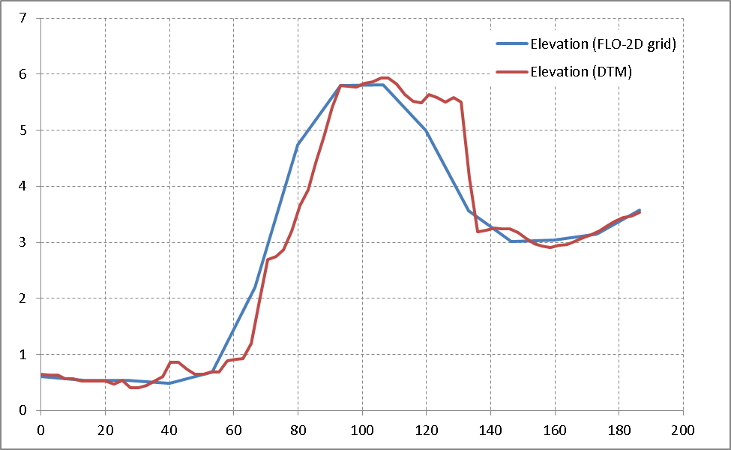

Topography tools
================
FLO-2D interprets topography to grids, based on the cell size user has defined. Sometimes, the grid size is too coarse and hence topographic features will not be represented within the FLO-2D grid sufficiently.

A set of tools will allow users to manipulate the base grid using a various vector type. 

Polygon correction
------------------
Using this feature, users can digitize a polygon for the area they want to raise or lower the topography of the cells falling below its extents.

Line correction
---------------
A single line where the cells along the line will be adjusted based on the elevation/height of the line.

Sloped line correction
----------------------
This is similar to the line correction, but the elevation/height will be assigned to the point snapped to the verticies of the line. Using these 2 types of geometry, users can represent a sloped line.
