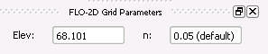
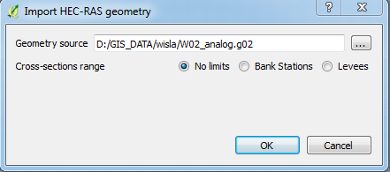
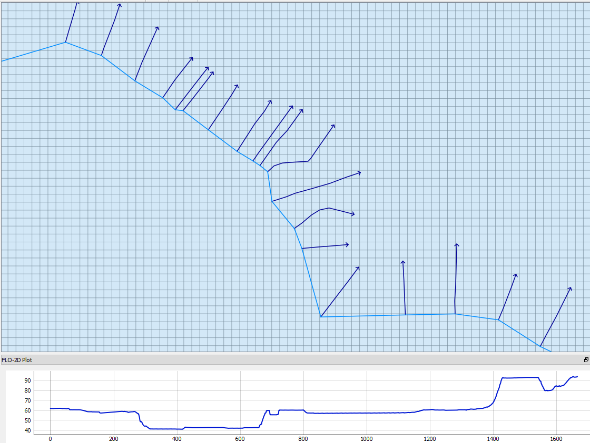
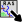
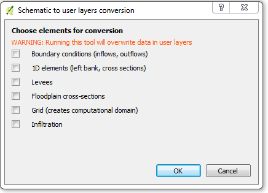
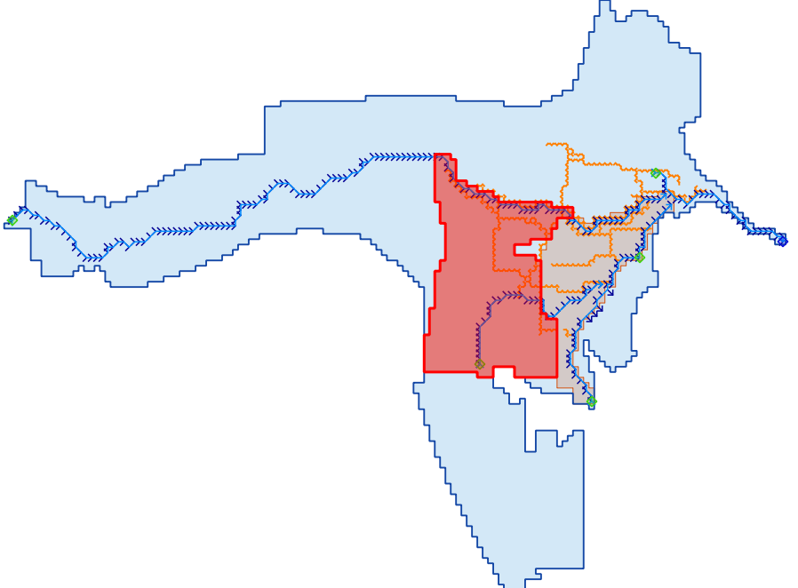

Tools and widgets
=================
There are several tools and widgets available for users to extract, convert and view various information from the FLO-2D model elements.

Info Tool
---------

To view information related to a FLO-2D element, you can use |InfoTool| Info Tool. This dedicated tool can be used to view hydrograph time series and plots, cross section table and plots, etc. The Info Tool works on both User Layers and Schematized layers.

Grid Info Tool
--------------

With this |GridInfoTool| tool, you can view elevation and roughness of each grid in a dockable panel. 

Import from GeoPackage
----------------------

With |GPKG2GPKG| tool you can import data directly from different Flo2D geopackage.
This can be helpful for importing data from geopackage created by older Flo2D plugin versions.

Import RAS geometry
-------------------
To import geometry data from HEC-RAS 1D model you can use |ImportRas| tool and choose proper .PRJ or .G0n file to import. It can convert and populate RAS geometry into *Left Bank Line* and *Cross-sections* user layers, which can be schematized to valid FLO2D model.
You can also limit imported cross-sections range to Banks and Levees (if available).

	*Import HEC-RAS geometry* dialog

	Imported RAS Geometry

Schematic to user layers conversion
-----------------------------------
With |Schema2User| tool you can convert in approximation schematic layers to user layers and continue your work on model with it.
It can be helpful for recreating user layers from just imported GDS models, without need of starting from scratch.

	*Schematic to user layers conversion* dialog

	User layers obtained from schematic layers conversion
