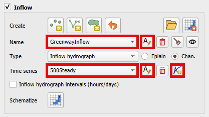

Boundary Condition Editor
=========================

The boundary condition editor is used to define the inflow and outflow boundaries.
The data is written to the INFLOW.DAT and OUTFLOW.DAT files.

Boundary Condition Editor
-------------------------

The new Boundary Condition Editor introduces several key updates, including:

- Separated the Inflow and Outflow Boundary Conditions into their own group.
- Separation of the Inflow and Outflow Boundary Condition schematize buttons.
- Added a button to remove the schematized data.
- Added a button to load existing INFLOW.DAT and OUTFLOW.DAT.
- Added the whole grid boundary condition.
- Grouped Boundary Condition tables into their own group.
- Hide/show Boundary Condition layers.

The Boundary Condition User Layers are only shown on the layer tree when the Inflow or Outflow Boundary Conditions
are checked. See image below.

Inflow Boundary Condition Editor
--------------------------------

Any number of inflow hydrographs to the FLO-2D model can be assigned to channel, floodplain or
even the 1-D street component. This represents a flood inflow to the flow domain from an off-site source.

Create Inflow Data
-------------------

1. To create a point of inflow, click the Add Point BC button on the Boundary Condition
   Editor widget.

2. Digitize the inflow node by left clicking the location of the inflow node on the map.
   In this example, the inflow node is a channel inflow node.
   It is not necessary to enter the fid.
   Click OK to create the feature.

.. image:: ../../img/Boundary-Condition-Editor/newbc005.png

3. Click again the toggled Add Point BC button to save the feature.

4. Click Yes to save the feature and
   to load the data into the editor.

.. note:: It is possible to add a line or a polygon inflow by using the Add Line BC or the Add Polygon BC buttons.

Load Inflow Data
-----------------

1. To load an INFLOW.DAT file, click on the Open INFLOW.DAT button.

.. image:: ../../img/Boundary-Condition-Editor/newbc014.png

2. Navigate to the folder containing the INFLOW.DAT file and select it.

3. A message on the QGIS toolbar will appear, indicating that the importing was successful.

.. image:: ../../img/Boundary-Condition-Editor/newbc016.png

.. note:: Loading the INFLOW.DAT file into the project appends data to the Boundary Condition layers/table,
          updating cells if already defined with a Boundary Condition. Additionally, all data added using this
          tool will be included in the Boundary Conditions Points User Layer.

Assign Conditions to the Inflow Boundary Conditions
----------------------------------------------------

5. Assign the conditions to the inflow node as seen in the following image. This example the
   inflow node will have a steady hydrograph with 100 cfs assigned to Cave Creek inflow node.

6. The time series inflow hydrograph is assigned in the table editor where time is in hours and discharge is cfs or cms.
   This is a clear water inflow hydrograph and no sediment concentration is assigned.

.. image:: ../../img/Boundary-Condition-Editor/newbc010.png

7. Repeat the process to add additional inflow hydrographs.
   Use the Add data series/table for current BC button to create a new hydrograph.

.. note:: Click on the lock into the selected inflow boundary condition button to highlight the selected inflow boundary condition on the Map Canvas when changing the Inflow Boundary Condition combobox.

    .. image:: ../../img/Boundary-Condition-Editor/newbc017.png

Delete Selected Inflow Boundary Condition
-----------------------------------------

8. To delete an Inflow Boundary Condition, click on the Delete Inflow Boundary Condition button.

.. note:: This button exclusively deletes the selected user Inflow Boundary Condition on the
          Boundary Condition Editor from the User Layers.

Schematize the data
---------------------

9. Use the Schematize button
   (shown below) to save the data to the Schematic Layers and click Yes to overwrite the layers.

.. image:: ../../img/Boundary-Condition-Editor/newbc013.png

Delete Schematized data
------------------------

8. To delete all schematized Inflow Boundary Conditions, click on the Delete Schematized Inflow Boundary Condition button
   and click Yes to delete all schematized Inflow Boundary Conditions.

.. image:: ../../img/Boundary-Condition-Editor/newbc020.png

.. note:: This button removes all schematized Inflow Boundary Conditions data, excluding the time series.

Outflow Boundary Conditions
----------------------------

Boundary outflow conditions include:

-  Normal depth control

-  Stage time control

-  Stage discharge control

These conditions define how the channel or floodplain discharge enters or leaves the FLO-2D model domain.

Outflow Floodplain
------------------

Normal depth boundary

This is an outflow condition where the flow leaves the domain without effecting the upstream water surface elevation,
select the outflow nodes along the downstream boundary or along the edge of a grid system.

1. Click the
   Add Polygon BC button

2. Digitize a polygon that covers the desired boundary extent.
   Right click the last vertex to close the polygon.

3. Set the type to
   Outflow and click OK.

4. Click again the toggled Add Polygon BC button to save the feature and activate the editor.

5. Name the boundary and set the outflow type to 1.
   Floodplain outflow (no hydrograph).

6. Click the Schematize button (shown below) to complete the boundary.

7. The Add Polygon BC button will identify cells at the grid boundary and designate them as outflow cells.

.. tip::

    It is possible to set the Outflow Boundary Conditions to the whole grid boundary cells faster using the
    Add Outflow Boundary Condition to the whole grid boundary cells button.

    .. image:: ../../img/Boundary-Condition-Editor/newbc028.png

    The algorithm in this button is more efficient than the Add Polygon BC. However, This boundary method applies a
    normal depth boundary to every grid element on the outer edge of the computational domain.

    A line is added to the center of the cells on the boundary of the grid.

    .. image:: ../../img/Boundary-Condition-Editor/newbc029.png

    Modification of the line is possible as needed.

    .. image:: ../../img/Boundary-Condition-Editor/newbc021.png

    When the schematize button is clicked,
    the whole boundary grid cells are defined as normal depth.

Outflow Channel
---------------

For channel outflow at a normal depth condition, use the channel outflow node on the downstream boundary
or channel segment terminus.

1. Click add a
   point boundary

2. Click the last left bank channel node.

.. image:: ../../img/Boundary-Condition-Editor/newbc031.png

3. Click again the toggled Add Point BC button to save the feature and activate the editor.

4. Name the
   feature and set the outflow condition
   for the channel to 3. Floodplain and channel outflow (no hydrograph).

.. note:: One point is required.

5. Click the Schematize button.

Outflow with Hydrograph
-------------------------

Multiple Domain System

Use this option with any floodplain boundary that will transfer flow between two domains.

.. note:: See `Multiple Domain Interfacing Training Package <https://flo-2d.com/product/multiple-domain-interfacing/>`__.

1. Click the Add Polygon BC button.

2. Draw a polygonn through the desired outflow nodes.

3. Click again the toggled Add Point BC button to save the feature and activate the editor.

4. Name the boundary condition
   and set the boundary Outflow type conditions as Outflow with Hydrograph.

5. Click the Schematize button.

Outflow with Time – Stage Hydrograph for Floodplain
-----------------------------------------------------

To represent variable time-stage boundary conditions such as:

-  Tides

-  Storm surge

-  Tsunamis

-  Flooding from a large river

The time–stage relationship can be synchronized with rainfall and upstream watershed flooding.
Select the outflow nodes along the downstream boundary with a polygon.

1. Click
   the Add Polygon BC button.

2. Digitize the
   polygon across the boundary.

3. Click again the toggled Add Point BC button to save the feature and activate the editor.

4. Name the boundary, set the boundary conditions, name and fill the
   Time Series table.

6. In the figure below,
   there are two sets of outflow nodes. The Normal Depth nodes allow water that exceeds the
   Stage to cross the outflow boundary.
   This allows rainfall accumulation or inflow hydrograph accumulation to leave the boundary. The Stage –
   Time nodes apply a water surface elevation.
   This water can fill the downstream area up to the stage.

Outflow with Time – Stage Hydrograph for Channel
-------------------------------------------------

Like the time-stage condition for the floodplain select this option to represent ocean tide, storm surge,
tsunamis, or flooding from a large river
control in a channel terminus.
The time – stage relationship can be synchronized to rainfall and watershed flooding.

1. Select the standard
   outflow node at the end of the channel.

2. Set the time-stage
   node one element upstream.

3. Click again the toggled Add Point BC button to save the feature and activate the editor.

4. Name the boundary
   and set the boundary conditions.

5. Name and
   fill the Time Series table.

.. image:: ../../img/Boundary-Condition-Editor/bounda017.png

Time-Stage for Floodplain and Free Floodplain and Channel
---------------------------------------------------------

Use this option to set the stage of a downstream elevation control.
This node will allow water to collect on the boundary until it can exceed the stage at the boundary.
It can be used for two purposes.

Anytime there is a control on the boundary that releases water at a known stage.

Set the elevation for matching the water surface elevation of an existing FEMA map.

1. Set this up with the
   same method described in the previous two sections.

Time-Stage for Channel and Free Floodplain and Channel
------------------------------------------------------

This option is the same as option 7 with the condition that the stage – time table is assigned to the channel instead of the floodplain.

1. Set this up with
   the same method described in the previous two sections.

Channel Stage-Discharge Parameters
------------------------------------

This outflow option defines the discharge from a channel based on the stage using rating curve.
Several rating curves can be assigned for multiple limiting depths.
This system is used when there is a control or a gage at the channel with a known stage-discharge relationship.

1. Select the
   stage-discharge node at the end of a channel segment.

2. Click again the toggled Add Point BC button to save the feature and activate the editor

3. Name the boundary
   and set the boundary conditions.

4. Name and fill the
   Q(h) parameters table.

Channel Stage-Discharge (Q(h) table)
-------------------------------------

The final outflow option is used to define the downstream boundary with a stage-discharge table.

1. Select the stage-discharge
   node at the channel terminus.

2. Click again the toggled Add Point BC button to save the feature and activate the editor

3. Name the boundary and set
   the boundary conditions.

4. Name and fill the Q(h)
   table.

Troubleshooting
----------------

1. The most common problems
   with creating outflow.dat data is caused by
   creating conflicts by putting other components in the outflow grid elements.

2. The schematic layers and tables will reset each time the Schematize tool is used.
   This could cause overwriting of imported data.
   Convert the Boundary Conditions to User Layers for projects that are imported into QGIS before performing the schematization process.

3. If the data does not export correctly, check the tables.
   The tables can be edited directly or can be copied into an OUTFLOW.DAT file.

4. Saving and restarting might
   resolve some issues with the GeoPackage but check the layers attributes prior to restarting QGIS.

5. If a Python Table Update error appears,
   Delete the QGIS folder from AppData/Roaming and rebuild the QGIS Profile.

.. image:: ../../img/Boundary-Condition-Editor/Bounda022.png
