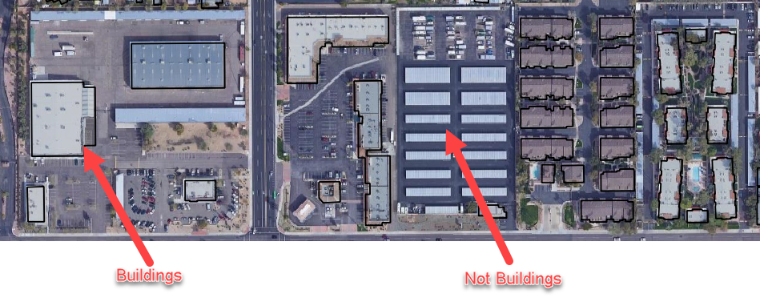
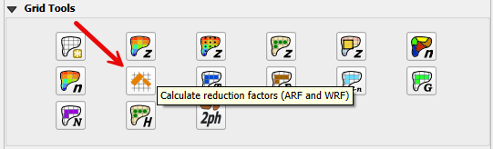
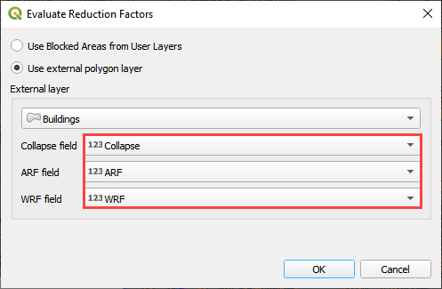
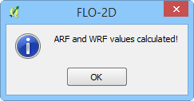
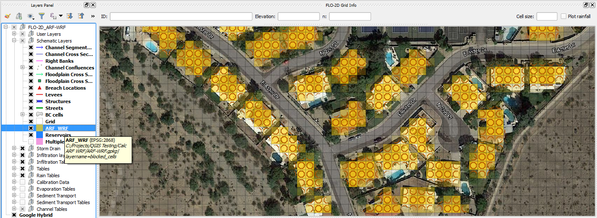
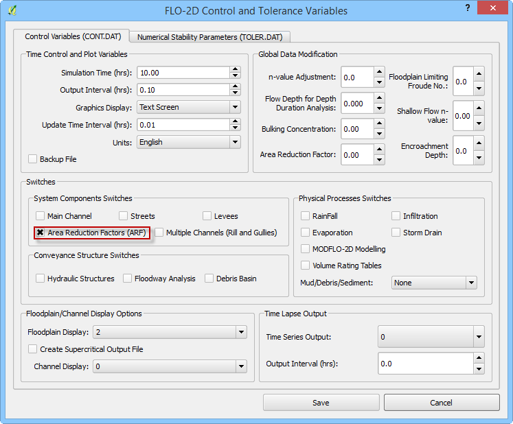

Area and Width Reduction – Buildings
=====================================

Overview
--------

The black polygons below are polygons that represent buildings or other features that displace and
redirect the flow as it moves over an area.  The blocked areas or external shapefiles are converted
to FLO-2D Area Reductions Factors (ARF) and Width Reduction Factors (WRF) in the Schematic Layer.

Use the QGIS Editing Tools Create Polygon tool to digitize or outline buildings with polygons or
import the building from an external layer.

Building polygons are also available in many locations from County GIS data.
If Buildings are not available, Tax Boundary polygons are available for all cities in the USA.

Calculate ARF and WRF layers
----------------------------

1. Click the Evaluate Reduction Factors (ARF and WRF) button.
   There are two options.
   Use the Blocked Areas Layer if constructing polygons from the digitizing tools.
   Use the external polygon layer if building polygons are in another layer.

2. Click OK and wait for the procedure to finish.
   The following message will appear and click OK to close it.

3. The ARF and WRF features
   are visible in the Schematic Layers group.

4. Click on the Set Control Parameters button, and then on the Control Variables (CONT.DAT) tab Check on Area Reduction Factors (ARF) and then click
   Save.

Troubleshooting
---------------

1. Missing building polygons from the
   Blocked Areas layer can be created.

2. If the Grid layer is empty,
   create a grid and try again.

3. If a Python error appears during the sampling procedure, the attribute table may be missing.
   Save and reload the project and try again.

4. If a polygon is outside the computational domain, it might result in an error.
   Delete buildings outside the computational domain.
