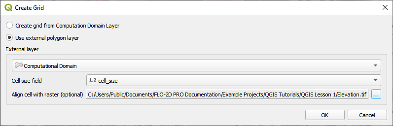
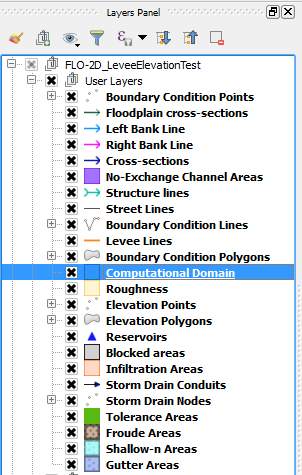
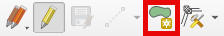
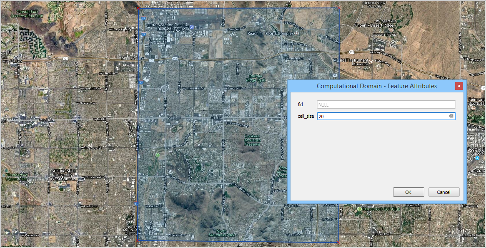
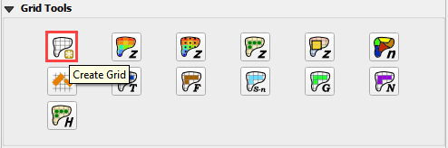
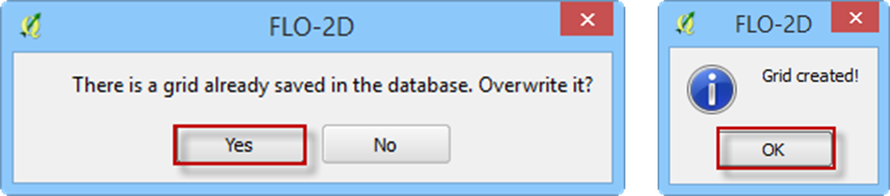
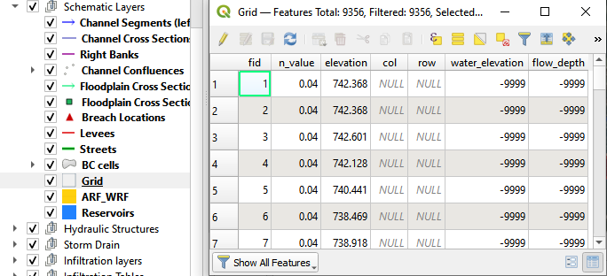

Create a Grid
=============

The system is limited to one domain.
The limits of the grid are defined by a single polygon.
This polygon can be digitized in the Computational Domain layer or it can be added from an external polygon layer such as an Area of Interest
shapefile with a single polygon.
Both methods are described below.

Method 1: Load an External Layer
-------------------------------

1. This method will use a shapefile
   with 1 polygon that represents the model area.

2. Select the shapefile and an
   attribute for cell size and click OK.

3. Optionally, select the elevation
   source to align the grid to a raster pixel.

4. The tool will add a polygon
   to the Computational Domain layer and then create the grid.

Method 2: Digitize the Computational Domain
-------------------------------------------

1. Select the Computational
   Domain layer in the Layers Panel>User Layers.

2. Select the *Toggle Editing*
   icon from the QGIS Toolbar to activate the editor and then click the *Add Feature* button to create a polygon.

 

3. Digitize the polygon in the map canvas and right click to close the polygon.
   Set the grid element size and click *OK* to complete the polygon.

4. Save the layer and turn off the
   editor by clicking the Editor tool to toggle it off.

5. From the Grid Tools widget,
   select Create Grid.

6. If this is a new project, the grid system will be created automatically.
   If this is a current project, the user will be asked to overwrite the current grid system.
   Click *Yes* to continue and *No* to cancel.
   Once the grid system is generated, the “Grid created!” message will appear.
   Click *OK* to close.

7. If the grid system is not as expected,
   edit the *Computational Domain* layer and repeat the *Create Grid* process.

8. Each time the grid system is replaced,
   the elevation and roughness data are also reset and must be recalculated.

9. The grid system data is
   saved to the *Grid* *Schematic Layer* as shown below.

