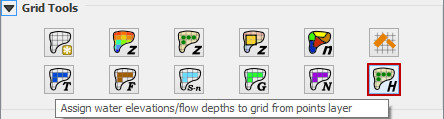
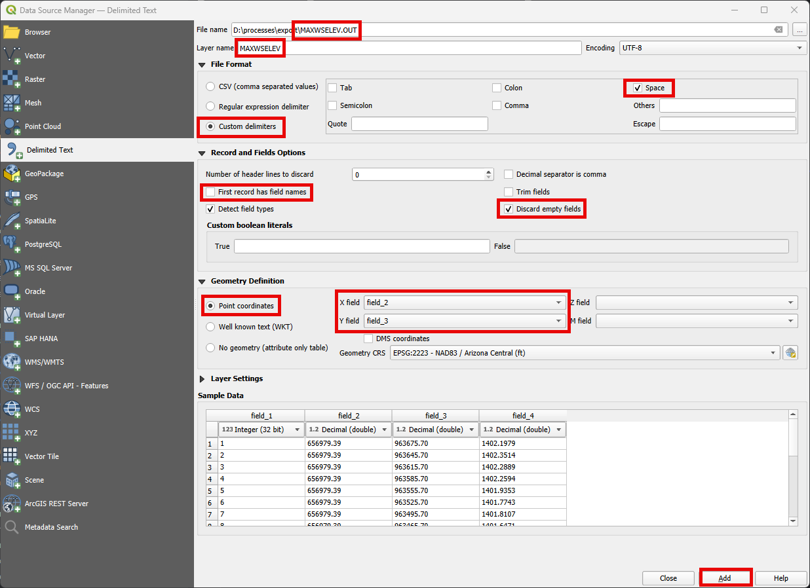
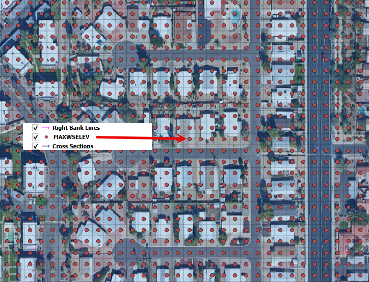
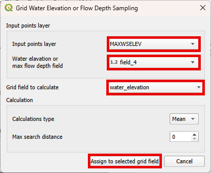
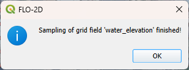
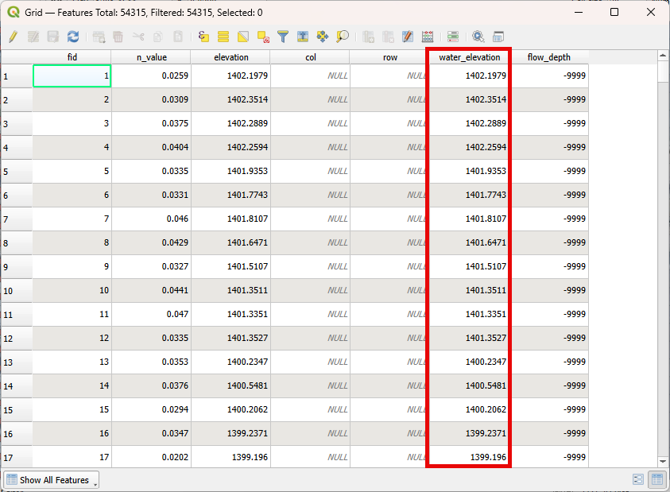

Assign Water Elevations/Flow Depths to Grid from Points Layer
==============================================================

This tool is used to assign water surface and depth to the grid layer.

Load MAXELEV
------------

1. Click on Layer>\ Add Layers >\ Add Delimited Text Layer or click on the Open Data Source Manager button
   and navigate to the Delimited Text tab.

.. image:: ../../img/Buttons/addlayer.png

2. Add the MAXELEV.OUT, following the figure below.

3. Check if the data was correctly processed.

.. note:: For a better visualization of the FLO-2D outputs, use MapCrafter. Check the FLO-2D-MapCrafter Wiki_.

          .. _Wiki:  https://github.com/FLO-2DSoftware/FLO-2DMapCrafter/wiki

Assign Water Elevations/Flow Depths to Grid from Points Layer
-------------------------------------------------------------

4. Click on the Assign Water Elevations/Flow Depths to Grid from Points Layer button.

5. Edit the dialog box as shown below and click the Assign to selected grid field button.

6. Wait the process to finish and click OK.

7. Check the Grid Attribute Table to verify if the data was correctly assigned.

.. note:: The same process can be performed for the DEPTH.OUT file.
