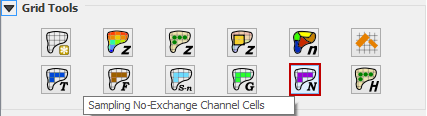
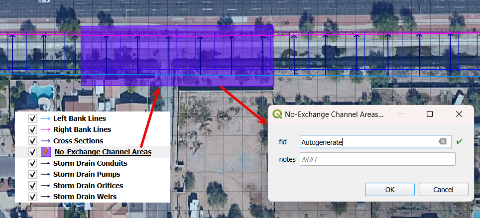
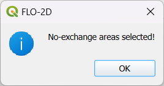

Sample No-Exchange Channel Cells
=================================

The no-exchange elements can be set up for any channel left bank element.
This will prevent the channel at that location from sharing discharge with the floodplain.

Digitize or Copy Data
---------------------

1. Select the layer or the No-Exchange Channel Areas and click Toggle
   Editing. Create polygons over the cells that will not exchange discharge with the floodplain. Save the
   No-Exchange Channel Areas layer and close the editor.

Sample Data
-----------

2. Click the Sample No-Exchange Channel Cells button in the Grid Tools and click
   OK when the process is complete.

.. note:: The No-Exchange Channel Cells are added to the CHAN.DAT file with the identifier "E".

    .. image:: ../../img/No-Exchange-Channel/No007.png

Troubleshooting
---------------

1. Create the No-Exchange polygons if they are missing
   from the No-Exchange Channel Areas.

2. If the Grid layer is empty,
   create a grid and try again.

3. If a Python error appears during the sampling process, the attribute
   table may be missing. Save and reload the project into QGIS and try
   again.
