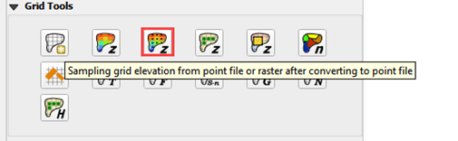
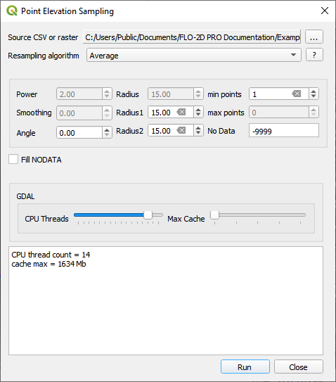
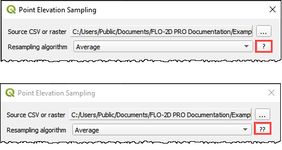
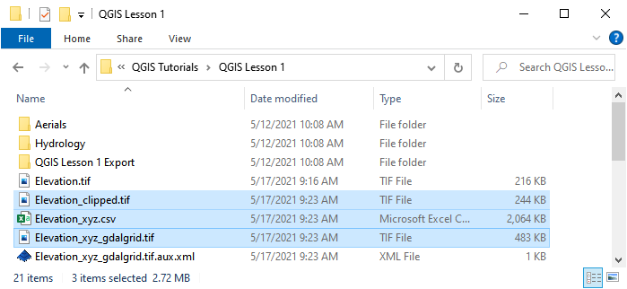

Sample Elevation GDAL Grid Method
==================================

To interpolate the elevation to a grid layer from a using the GDAL Grid method.

Sample Elevation
----------------

1. Click the Sampling grid elevation from point or raster file button and enter the required data in the dialog fields.
   As shown below.

2. Select the Fill NODATA option to set the elevation of empty grid elements from neighbors.

3. Click
   Run.

1. Learn more about the
   GDAL Grid method with the help buttons.

2. Click the button once
   to load a GDAL page with interpolation algorithm data.

3. Click the button again
   to load a GDAL grid tutorial.

4. When the interpolation process
   is complete, several new elevation files are written to the project elevation directory.

5. The clipped elevation raster to
   eliminate excess data.

6. The elevation csv file is used for
   the interpolation.

7. The elevation_xyz_gdalgrid.tif
   is sampled to the grid layer.

8.  A log of the interpolation
    process helps the user track the progress.

9.  The user can set the CPU thread count
    and the memory cache allowed by the processors. This ensures the computer will not slow down while the optimized calculations are performed.

10. Once the Finished Computation message
    appears. Click Close.

Check this image here:

.. image:: ../../img/Sample-Elevation-Data-GDL-Grid-Method/Sample006.png

Troubleshooting
---------------

1. This process can be slow if the project has high resolution elevation data.
   If LiDAR point data is being used, try the LiDAR processor instead.
   If a high-resolution raster is being used.
   try the Sample Elevation from Raster instead.

2. If the elevation data has the wrong CRS or does not have complete coverage, calculation may still be performed but the elevation will be no good.
   Always spot check the elevation.

3. If the Finished Computation message is displayed but the grid table still has -9999 as the elevation, the raster CRS is not being read correctly.
   Save the data as a new layer and assign the correct CRS.
