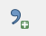

Sample Elevation Data from Points and LiDAR
===========================================

Load Elevation Points
----------------------

.. image:: ../../img/Buttons/addlayer.png

1. Click on *Layer*>\ *Add Layers* >\ *Add Delimited Text Layer* or click on the *Open Data Source Manager* icon and navigate to the *Delimited Text* tab.
   Add the delimited text data, following the figure below.

2. There are many options to help sort the data.
   Select the options that reflect the desired dataset and click *add.*

.. image:: ../../img/Sample-Elevation-From-Points/Sample002.png

Apply a Style
-------------

The data has a default style so it isn’t very easy to view elevation.

1. Adjust the Style properties of the elevation data to assist the quality control measures for reviewing the data.
   For example, elevation data that has a large range can wash out the detail in local areas of the project area.

2. Double
   click the layer to open the *Properties* window and select the style tab to perform the following.

3. Assign
   graduated colors;

4. Select field
   to represent colors;

5. Select
   color ramp;

6. Classify the data
   (classifying the data adjustments will assist in locating erroneous data).

.. image:: ../../img/Sample-Elevation-From-Points/Sample003.png

7. The point data style
   is a graduated color scheme set to the elevation scale (see figure below).

.. image:: ../../img/Sample-Elevation-From-Points/Sample004.png

Sample Data
-----------

1. Click the *Assign Elevation
   to Grid from Points Layer* icon to interpolate the elevation data to the grid.

.. image:: ../../img/Sample-Elevation-From-Points/Sample005.png

2. The sampling dialog box
   appears to select the point source, elevation field, and calculation type.

3. Choose a max search distance to extend the search for empty grid elements.
   The distance is in the native map units.

4. This field can be
   assigned a zero value to default to the minimum search distance.

.. image:: ../../img/Sample-Elevation-From-Points/Sample006.png

5. Once the calculation is complete, the following dialog is displayed.
   Click *OK* to continue.

.. image:: ../../img/Sample-Elevation-From-Points/Sample008.png

6. The elevation
   data is saved to the *Grid* Layer in the *Schematic Layers* group.

.. image:: ../../img/Sample-Elevation-From-Points/Sample009.png

LiDAR Data
----------

The LiDAR method can interpolate data from multiple files.
It applies a simple average to the point within a cell and can patch missing LiDAR elevation from areas that are filtered from the ground data
category.

1. Click the
   *Assign Elevation to Grid from Points Layer* icon to interpolate the elevation data to the grid.

.. image:: ../../img/Sample-Elevation-From-Points/Sample005.png

2.	Choose the Interpolate from LiDAR files option and click OK.

.. image:: ../../img/Sample-Elevation-From-Points/Sample014.png

3. Select the bare earth data LiDAR data files that cover the project area.
   These are determined using the LiDAR tiles shapefile.

4. Click Open.
   The LiDAR file must have a \*.txt extension.

.. image:: ../../img/Sample-Elevation-From-Points/Sample010.png

5. When the file is processing,
   two progress bars can be seen in QGIS.

.. image:: ../../img/Sample-Elevation-From-Points/Sample011.png

6. LiDAR data is bare earth data
   so categories such as buildings, bridges, overpasses are removed from the point data.

.. image:: ../../img/Sample-Elevation-From-Points/Sample012.png

7. The plugin will fill this data with a nearest neighbor patch.
   Select the first option and click ok to fill the missing data.

.. image:: ../../img/Sample-Elevation-From-Points/Sample013.png

Troubleshooting
---------------

1. If the elevation data is not visible, check the CRS.
   It may be necessary to transform the data into the correct CRS.

2. If the elevation layer does not show up in the *Sample Elevation Dialog* box, make sure it is a point layer and that it is checked on in the *Layers*
   List.

3. If a Python error appears during the sampling, it may indicate that there is no attribute table.
   Save and reload the project into QGIS and try again.

.. |Sample014| image:: ../../img/Sample-Elevation-From-Points/Sample014.png

