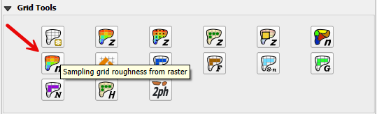
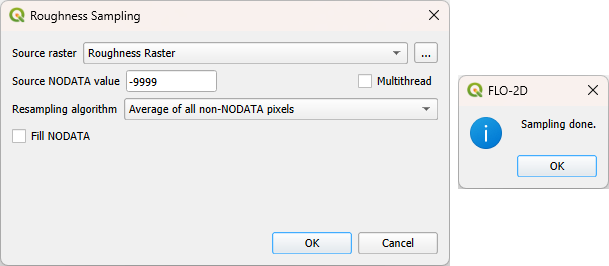

Sampling Grid Roughness from Raster
===================================

This tool calculates the the spatially variable manning’s roughness from a raster.
The raster represents roughness associated with different LandUse categories such as building, street, grass,
desert brush and many others.

Sample Roughness from Raster
-----------------------------

1. Click the Sampling Grid Roughness from Raster and enter the required data
   in the dialog fields as shown below.

2. Select the Fill
   NODATA option to set the elevation of empty grid elements from
   neighbors.

.. note:: This is only necessary if there are empty raster pixels.

3. Click OK.  When the elevation sampling is completed, close the Sampling Done box.

Troubleshooting
---------------

1. If the project or the data is on a server, this function may fail.
   Ensure all data is on the computer drive.

2. If the raster has the wrong Coordinate Reference System (CRS) or does not have complete coverage,
   save the raster with the correct CRS and make sure it has complete coverage.

3. If the “Sample Done” box is displayed but the grid table still has
   -9999 as the n_value, the raster CRS is not being read correctly.
   Save the raster as a new layer and assign the correct CRS.