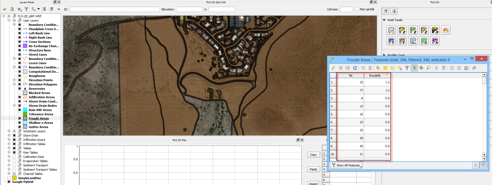
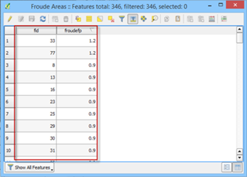
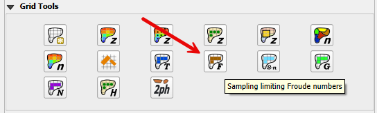
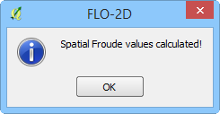

Spatial Limiting Froude
=======================

Overview
--------

The Spatial Limiting Froude layer is used to set a limiting Froude number for individual FLO-2D grid elements.
For example, overland flow on a gentle slope will become subcritical so a limiting Froude value of 0.9 can be assigned.
If the limiting Froude is exceeded, the cell roughness n-value is incrementally increased and maintains numerical stability that might occur for
severe supercritical flow.
For further discussion on the limiting Froude numbers refer to the FLO-2D Data Input Manual.

Digitize or Copy Data
---------------------

1. Select the Froude Areas
   layer and click Toggle Editing.

2. Create or copy the polygons that
   represent the Froude areas to the layer and save them.

Sample Data
-----------

1. Click the Sampling
   Froude Numbers button.

2. Once the process is
   complete OK to close it.

Troubleshooting
---------------

1. Create the limiting Froude
   polygons if they are missing from the Froude Areas layer.

2. If the Grid layer is empty,
   create a grid system and try again.

3. If a Python appears during the sampling process, the attribute table may be missing.
   Save and reload the project into QGIS and try again.
