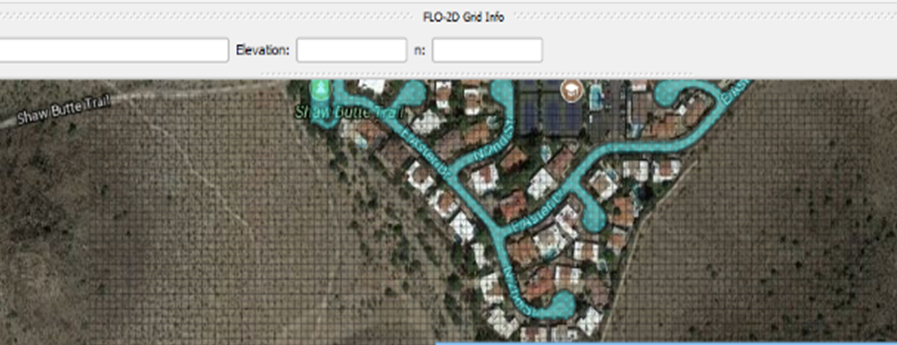
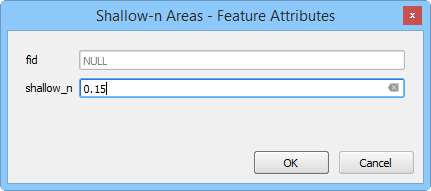
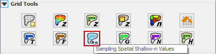

Spatial Shallow n
=================

Overview
--------

A spatially variable shallow n-value enables the flow roughness to be depth integrated to enable high n-values at shallow flow depths.
The value can also be globally assigned in the FLO-2D Control and Tolerance Variables window.
Polygons can be applied to select individual or groups of grid elements to supersede the global n-value as in the case for streets and parking lots.

Digitize or Copy Data
---------------------

1. Select the Shallow-n Areas
   layer and click edit.

2. Create or copy the polygons
   that represent the shallow roughness areas to the layer and save them.

Sample Data
-----------

1. Click the Sampling Spatial Shallow-n Values
   button and then OK once the process is complete.

.. image:: ../../img/Spatial-Shallow/spatia004.png

Troubleshooting
---------------

1. Create the shallow-n polygons
   if they are missing from the Shallow-n Areas layer.

2. If the Grid layer is empty,
   create a grid and try again.

3. If a Python error appears during the sampling process, the attribute table may be missing.
   Save and reload the project into QGIS and try again.
