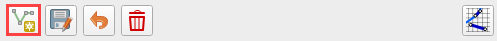
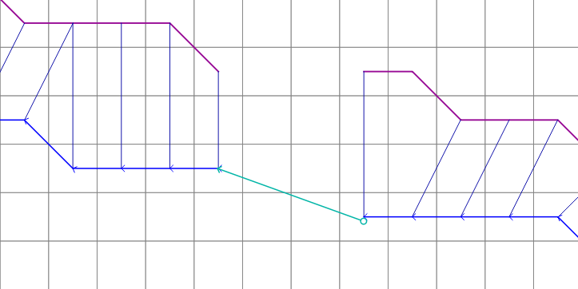
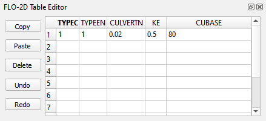
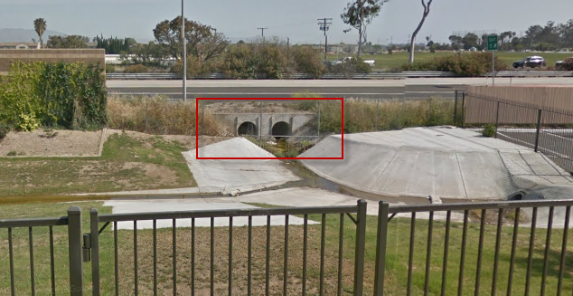
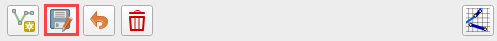
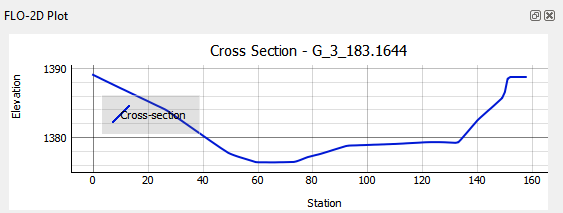
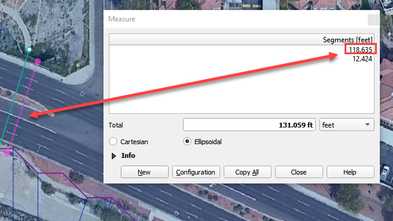
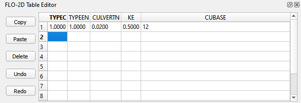
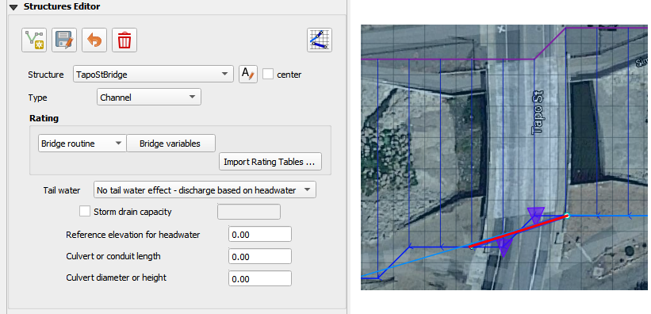
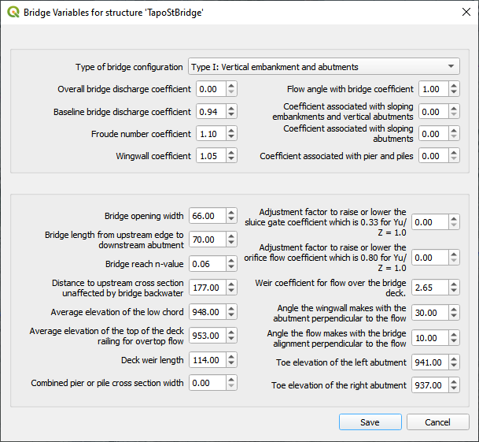

Hydraulic Structure Editor
==========================

The hydraulic structures editor is used to set up the data for the HYSTRUCT.DAT file.
This section will describe how to set up each of the different types of hydraulic structures.

.. image:: ../../img/Hydraulic-Structure-Editor/Hydrau002.png

Channel to Channel Structure
----------------------------

Culvert Type:

-  Channel to Channel

-  Generalized Culvert Equation

This structure will simulate discharge through a box culvert.
This example has a box culvert that is longer than the grid element.
The channel segments are split up to allow for the width of the roadway.

1. Click the Add
   Structure button.

2. Digitize a culvert
   by clicking on the two blue left bank elements that represent the beginning and end of the hydraulic structure.

3. Click upstream first and downstream second.
   There are small arrows on the channel that show the flow direction.

4. The structure line
   also has an arrow to show flow direction.

5. Do not use a structure on the magenta right bank lines.
   Culverts are only assigned to the left bank nodes.

6. Click
   Save.

7. Fill the
   widget form.

8. In the generalized
   culvert equation, conduit with is used to represent the culvert height or diameter.

.. image:: ../../img/Hydraulic-Structure-Editor/Hydrau002.png

9. Fill the
   table.

10. Click Schematize
    button to write the data to the schematic layers.

.. image:: ../../img/Hydraulic-Structure-Editor/Hydrau007.png

Floodplain to Floodplain Structure
----------------------------------

This example will model a culvert system between two floodplain nodes.
The invert elevation of the inlet node is set by the grid element elevation.

1. Click the Add
   Structure button.

2. Digitize a culvert
   by clicking on two cells closest to the inlet and outlet on the map.

3. Use the elevation
   values to make sure that the invert elevations are correct.

.. image:: ../../img/Hydraulic-Structure-Editor/Hydrau010.png

4. Click
   Save.

5. Fill in the data
   on the Structure Editor and the Table Editor.

6. No need for culvert
   geometry because this culvert uses a rating table.

7. No need for reference
   elevation because this culvert discharge starts when the water enters the upstream grid element.

.. image:: ../../img/Hydraulic-Structure-Editor/Hydrau012.png

8. Fill the
   rating table.

.. image:: ../../img/Hydraulic-Structure-Editor/Hydrau013.png

9. Click Schematize
   to write the data to the schematic layers.

.. image:: ../../img/Hydraulic-Structure-Editor/Hydrau007.png

Floodplain to Channel Structure
-------------------------------

This example shows a culvert that connects a basin to a channel.

1. Click the Add
   Structure button.

2. Digitize a culvert by clicking on two cells closest to the inlet and outlet on the map.
   The outlet should be assigned to a blue channel node.

3. Use the grid
   elevation values and channel invert to make sure that the invert elevations are correct.

.. image:: ../../img/Hydraulic-Structure-Editor/Hydrau014.png

4. The culvert is assigned to the channel cross section.
   That is why the feature must be applied to a left bank channel node.

5. Click
   Save.

6. In this case the stage of the water in the channel may cause submergence.
   The tailwater switch should be set to Reduced Discharge and upstream flow allowed.

7. The culvert length is 118ft.

8. This is a pedestrian crossing so the culvert height must be at least 8 ft.

9.  The width
    of the structure is approximately 12 ft.

10. There are
    30-degree wingwalls.

.. image:: ../../img/Hydraulic-Structure-Editor/Hydrau017.png

11. Fill the table form.

.. image:: ../../img/Hydraulic-Structure-Editor/Hydrau018.png

12. Fill in
    Rating Table data.

13. Click Schematize to
    write the data to the schematic layers.

.. image:: ../../img/Hydraulic-Structure-Editor/Hydrau007.png

Bridge
------

Bridge parameters can be defined for a structure.

The USGS bridge tables are used to define the flow though a bridge with bridge geometry and discharge coefficients.
See Bridge tutorial and Bridge guidelines for a detailed guide.

Import Rating Tables
--------------------

1. Click the
   Import Rating Tables button.

2. Select all of the
   rating table files and open them.

3. The files must
   have the same name as the structure.

4. The rating table data is
   Depth (ft or m) and Discharge (cfs or cms).

5. The columns
   can be space or tab delimited.

6. No
   header.

.. image:: ../../img/Hydraulic-Structure-Editor/Hydrau022.png
