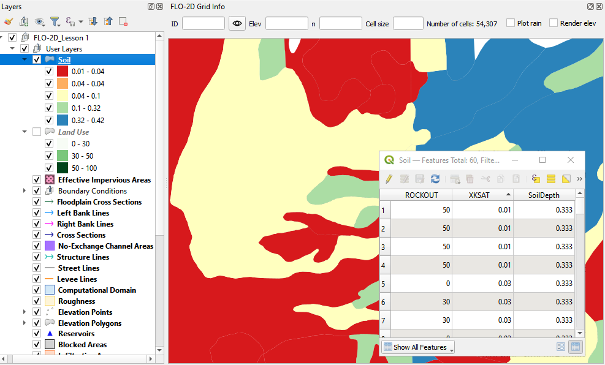
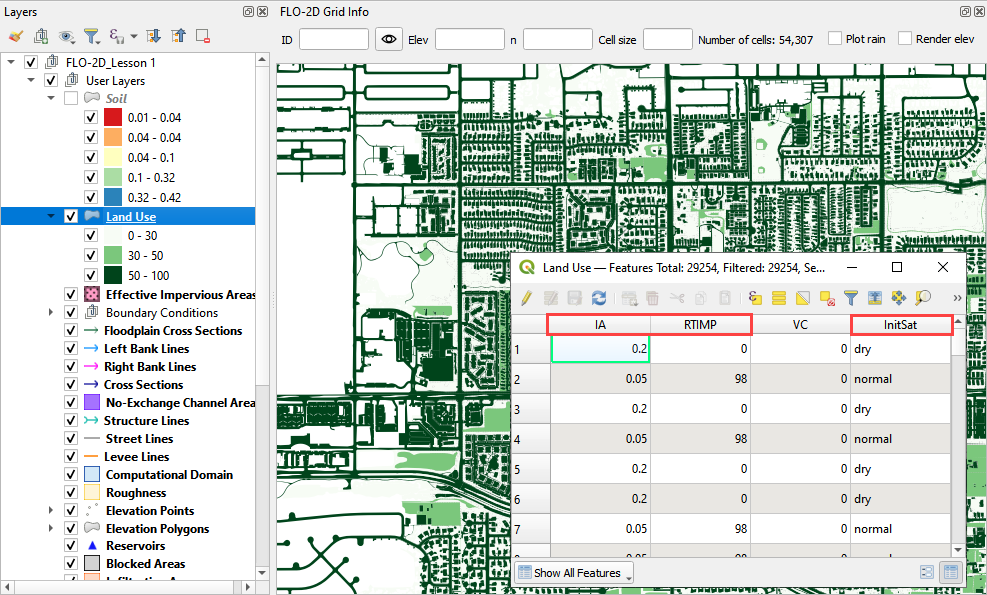
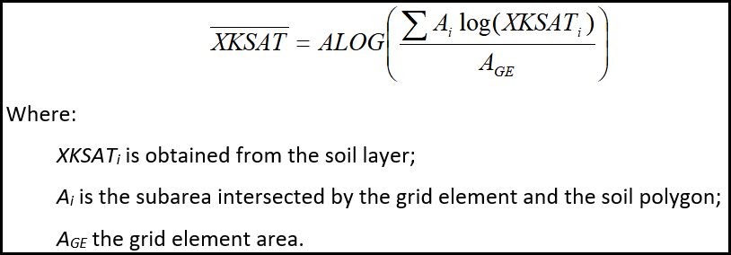
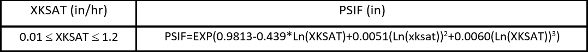
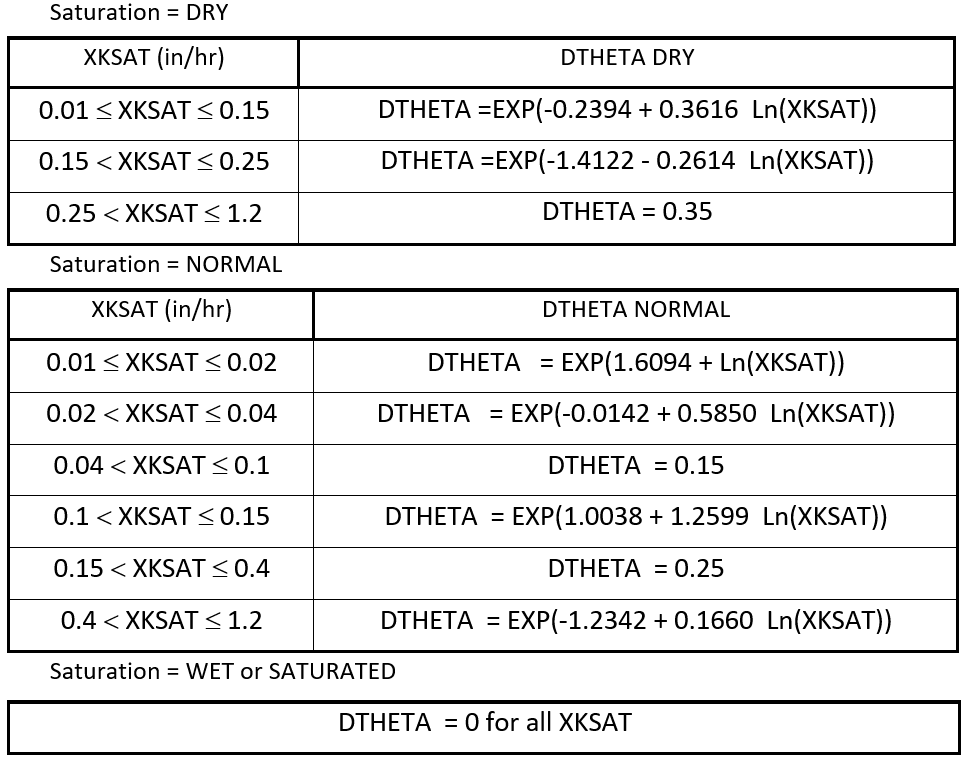
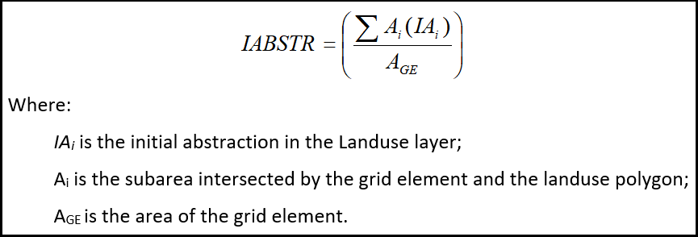
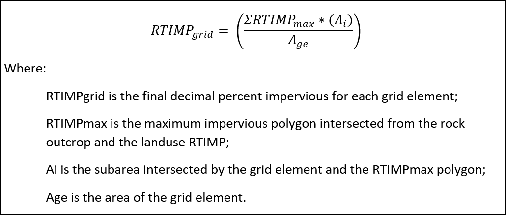

Infiltration Editor
===================

Green-Ampt
----------

The Green-Ampt infiltration editor can add global or spatially variable infiltration data to the INFIL.DAT file.

Global Uniform Infiltration
----------------------------

1. Global data is set  
   up using the Global Infiltration button.

2. Click the button  
   to open the editor dialog box.

.. image:: ../../img/Infiltration-Editor/Infilt002.png

.. image:: ../../img/Infiltration-Editor/Infilt003.png

This option will set up uniform infiltration data for every grid element.

.. image:: ../../img/Infiltration-Editor/Infilt004.png

Spatial Infiltration from User Layer
------------------------------------

Spatially variable floodplain infiltration is set by digitizing infiltration polygons or importing infiltration polygons.
Use the polygon editor to digitize spatially variable infiltration.
Create a polygon to represent an area of infiltration.

1. Click the create  
   a polygon tool and digitize a polygon.

2. Name the  
   infiltration polygon.

3. Fill the  
   table for the infiltration data.

4. Click  
   Save.

5. Fill the  
   data in the widget for each new polygon.

.. image:: ../../img/Infiltration-Editor/Infilt005.png

An alternate method to fill data to use the Attribute Table for the Infiltration User Layer.

1. Right click  
   the layer and open the attribute table.

.. image:: ../../img/Infiltration-Editor/Infilt006.png

2. Click the Edit Pencil and start editing the data.
   Save and close the window.

.. image:: ../../img/Infiltration-Editor/Infilt007.png

3. The data will  
   automatically update in the widget.

4. Click the Schematize  
   button to commit the changes to the grid.

.. image:: ../../img/Infiltration-Editor/Infilt008.png

The infiltration polygons outline areas of cells that have similar infiltration characteristics.
In the following image, the infiltration areas are different for urban, desert and desert drainage.

.. image:: ../../img/Infiltration-Editor/Infilt009.png

Channel Infiltration
---------------------

1. To assign channel  
   infiltration, use the channel infiltration editor.

2. Set a global  
   hydraulic conductivity for all channel elements.

3. Click the Channel  
   Infiltration button.

.. image:: ../../img/Infiltration-Editor/Infilt010.png

4. Local channel  
   infiltration is set by segment in the dialog box.

.. image:: ../../img/Infiltration-Editor/Infilt011.png

Green-Ampt Infiltration Calculator FCDMC Method
------------------------------------------------

To use the Flood Control District of Maricopa County (FCDMC) Green-Ampt calculator, the user must prepare soil,
landuse, and eff shapefiles.  The data is provided by the District.  See the FCDMC hydrology manual for a more detailed
discussion on modeling with the Green and Ampt method.

1. Prepare the soil data shapefile as seen in the following figure.

 - ROCKOUT is the percentage of rock outcrop coverage.  0 to 100
 - XKSAT is the hydraulic conductivity for the soil group. in/hr
 - Soil Depth is the limiting infiltration depth. Once the infiltration reaches this depth, it will turn off.  ft or m

2. Prepare the Landuse data shapefile as seen in the following figure.

 - Saturation is the initial saturation condition.  wet, dry, or normal
 - Initial Abstraction storage depth that must be reached before infiltration begins.  in or mm
 - Impervious area is the percentage of impermeability for a given polygon.  0 to 100
 - Vegetative cover is not used by FCDMC.

3. Prepare the EFF data shapefile as seen in the following figure.

 - Eff is the percent effectiveness of the impervious space.  It pertains more to HEC-1 calculations but can also be
   applied as an additional control or adjustment for a 2D grid.  If an EFF polygon is present, the calculator will
   multiply the RTIMP grid * the EFF to determine a final RTIMP.  0 to 100

.. image:: ../../img/Infiltration-Editor/infil003.png

4. To run the calculator,
   click the Calculate Green-Ampt button.

.. image:: ../../img/Infiltration-Editor/Infilt014.png

5. Fill the form and
   click OK.

.. image:: ../../img/Infiltration-Editor/Infilt015.png

6. The calculator uses the following
   methods for the FCDMC Green-Ampt Infiltration.

**Hydraulic Conductivity** (XKSAT) is calculated by an intersection between the soil polygons and the grid with
a log weighted average calculation.

**Capillary suction** (PSIF) is derived from a lookup table in the FCDMC Hydrology Manual Composite Values of PSIF
and DTHETA as a Function of XKSAT.

**Soil moisture deficit** (DTHETA) is the volumetric measurement of the soil moisture storage capacity.  It is also
derived from a FCDMC table for Composite Values of PSIF and DTHETA as a function of XKSAT.  The following lookup
lookup tables are applied based on the Initial Saturation Condition.

**Initial abstraction** (IA) is the intersection between the Landuse polygons and the grid with an area weighted
average calculation.

**Impervious** - (RTIMP) is the percent impervious for the grid element.  This calculation
is taken from an area weighted average of the RTIMPmax and the grid element.

**RTIMPmax** - Intersection(Landuse, Soil) makes a temporary polygon
layer of the maximum of the parts from RTIMPlu and RockOut.

**RTIMPgrid** - Intersection(RTIMPmax, Grid)
calculates the area weighted average RTIMP for each grid element.

**RTIMPfinal** - Intersection(EFFareas, Grid)
samples the EFFareas * 0.01 * RTIMPgrid for any grid centroid within an EFF polygon.

7. When the infiltration
   calculator is finished, the following message will appear.

.. image:: ../../img/Infiltration-Editor/Infilt016.png

8. The INFIL.DAT file
   looks like this.  For a detailed explanation of these variables, see the FLO-2D Data Input Manual INFIL.DAT section.

.. image:: ../../img/Infiltration-Editor/Infilt017.png

SCS
---

Global Uniform Infiltration
----------------------------

The SCS infiltration editor can add global or spatially variable infiltration data to the INFIL.DAT file for
infiltration curve numbers.

1. Set up the Global Infiltration first.
   Click Global Infiltration.

.. image:: ../../img/Infiltration-Editor/Infilt018.png

2. Fill the Global  
   Infiltration dialog box.

.. image:: ../../img/Infiltration-Editor/Infilt019.png

3. The INFIL.DAT file  
   looks like this:

4. Where the infiltration  
   type is 2 = SCS infiltration.

5. The 85 is the uniform curve  
   number for each grid.

6. The 0.01 is the initial  
   abstraction.

.. image:: ../../img/Infiltration-Editor/Infilt020.png

Spatial Infiltration from User Layer
------------------------------------

.. note:: This method is the most effective way to sample SCS data.  If using the other calculators, review SCS column
          for errors.

Spatially variable floodplain infiltration is set by digitizing infiltration polygons or importing infiltration polygons.
Use the polygon editor to digitize spatially variable infiltration.
Create a polygon to represent an area of infiltration.

1. Select the Infiltration  
   Areas user layer.

2. Click the editor pencil and  
   snapping magnet button.

.. image:: ../../img/Infiltration-Editor/Infilt021.png

3. Create the polygons the  
   represent areas with the same curve number.

4. Fill the table for the  
   infiltration data.

.. image:: ../../img/Infiltration-Editor/Infilt022.png

5. The finished table has a  
   CN for every polygon.

6. Click the Save button to  
   save the attributes.

7. Click the pencil button  
   to close the editor.

.. image:: ../../img/Infiltration-Editor/Infilt023.png

8. Check the data in the Infiltration Editor Widget.
   Click the Schematize button to complete the process.

.. image:: ../../img/Infiltration-Editor/Infilt024.png

9. The spatially variable  
   INFIL.DAT looks like this:

.. image:: ../../img/Infiltration-Editor/Infilt025.png

Curve Number Generator
-----------------------

1. If necessary,
   add the Plugin Curve Number Generator.

.. image:: ../../img/Infiltration-Editor/Module311.png

2. Open the Curve
   Number Generator.

.. image:: ../../img/Infiltration-Editor/Module312.png

3. Set the Area Boundary
   to the Grid.  Check the boxes and click OK.

.. image:: ../../img/Infiltration-Editor/Module313.png

4. Click Close when
   process is finished.  The Curve Number Polygon Layer can be used in the next section.

SCS Calculator Single Shapefile
-------------------------------

.. warning:: If applying this method, review min and max of the SCS field.  This method only works on polygon shapefiles
             that have no geometric deficiencies.  If this method results in errors, copy the polygons to the User layer
             field and use the User Layer Method.

This option will add spatially variable infiltration data to the grid from a shapefile with one CN attribute field.

1. Click the Calculate  
   SCS CN button.

.. image:: ../../img/Infiltration-Editor/Infilt026.png

2. Select the layer and field  
   with the infiltration data and click OK to run the calculator.

3. This method works for  
   shapefiles that have a CN already calculated.

4. Click OK to calculate a  
   spatially variable CN value for every grid element.

.. image:: ../../img/Infiltration-Editor/Infilt027.png

5. When the calculation is complete, the following box will appear.
   Click OK to close the box.

.. image:: ../../img/Infiltration-Editor/Infilt028.png

6. The INFIL.DAT file  
   looks like this.

.. image:: ../../img/Infiltration-Editor/Infilt029.png

SCS Calculator Single Shapefile Multiple Fields Pima County Method
-------------------------------------------------------------------

Use this option for Pima County to calculate SCS curve number data from a single layer with multiple fields.
This is a vector layer with polygon features and field to define the landuse/soil group, vegetation coverage and impervious space.
This option was developed specifically for Pima County.

The data should be arranged as shown in the attribute table.

.. image:: ../../img/Infiltration-Editor/Infilt030.png

1. Click the  
   Calculate SCS CN button.

.. image:: ../../img/Infiltration-Editor/Infilt031.png

2. Select the layer  
   and fields with the infiltration data and click OK to run the calculator.

.. image:: ../../img/Infiltration-Editor/Infilt032.png

3. When the calculation is complete, the following box will appear.
   Click OK to close the box.

.. image:: ../../img/Infiltration-Editor/Infilt033.png

Horton
------

Global Uniform Infiltration
---------------------------

The Horton infiltration editor can add global or spatially variable infiltration data to the INFIL.DAT file for.

1. Set up the Global Infiltration first.
   Click Global Infiltration.

.. image:: ../../img/Infiltration-Editor/Infilt018.png

2. Fill the Global  
   Infiltration dialog box.

.. image:: ../../img/Infiltration-Editor/Infilt034.png

Uniform Horton infiltration is assigned as follows in the INFIL.DAT file:

.. image:: ../../img/Infiltration-Editor/Infilt035.png

Horton Spatially Variable Method
--------------------------------

Spatially variable Horton infiltration is created by digitizing infiltration polygons.
Use the polygon editor to digitize spatially variable infiltration.
Create a polygon to represent an area of infiltration.

1. Click the create a  
   polygon tool and digitize a polygon.

.. image:: ../../img/Infiltration-Editor/Infilt036.png

2. Click  
   Save.

.. image:: ../../img/Infiltration-Editor/Infilt037.png

3. Right Click the Infiltration Areas layer (User Layers) and open the Attributes Table.
   Click the Editor Pencil button.

4. Name the infiltration  
   polygons and fill out the data for fhorti, fhori, and deca.

5. Click the Save button  
   and Editor Pencil button.

6. Click  
   Schematize.

.. image:: ../../img/Infiltration-Editor/Infilt038.png

.. image:: ../../img/Infiltration-Editor/Infilt039.png

7. The spatially  
   variable Horton looks like this in the INFIL.DAT file.

.. image:: ../../img/Infiltration-Editor/Infilt040.png

Troubleshooting
---------------

1. Infiltration calculators all use intersection tools.
   This can cause problems if the shapefiles are not set up correctly.
   Specifically, land use and soils shapefiles that may have been converted from raster data.
   If errors persist, try “fix geometry”, “simplify”, and “dissolve” on the source shapefiles.
   These tools are part of the QGIS Processing Toolbox.
   They can also be corrected in ArcGIS if the datasets are very large.

2. Make sure the shapefiles completely cover the grid.
   If a grid element is outside the coverage of the infiltration, QGIS will show an error.

3. Make sure the shapefile fields have a correctly defined number type.
   The shapefiles that are supplied with the QGIS Lessons will help define the Field Variable Format such as string,
   whole number or decimal number.
