Infiltration Editor
===================

Green-Ampt
----------

The Green-Ampt infiltration editor can add global or spatially variable infiltration data to the INFIL.DAT file.

Global Uniform Infiltration
----------------------------

1. Global data is set  
   up using the Global Infiltration button.

2. Click the button  
   to open the editor dialog box.

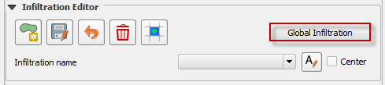

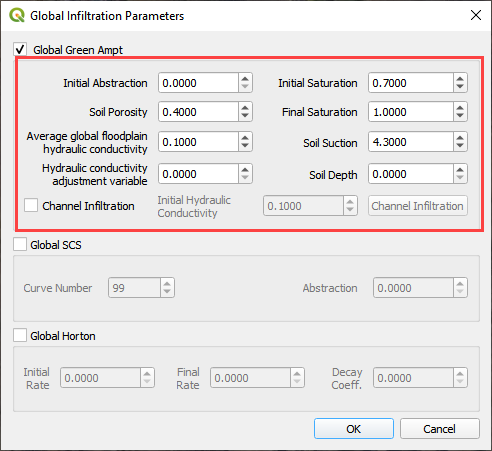

This option will set up uniform infiltration data for every grid element.

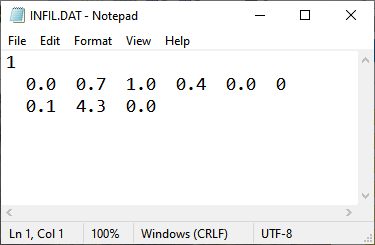

Spatial Infiltration from User Layer
------------------------------------

Spatially variable floodplain infiltration is set by digitizing infiltration polygons or importing infiltration polygons.
Use the polygon editor to digitize spatially variable infiltration.
Create a polygon to represent an area of infiltration.

1. Click the create  
   a polygon tool and digitize a polygon.

2. Name the  
   infiltration polygon.

3. Fill the  
   table for the infiltration data.

4. Click  
   Save.

5. Fill the  
   data in the widget for each new polygon.

.. image:: ../../img/Infiltration-Editor/Infilt005.png

An alternate method to fill data to use the Attribute Table for the Infiltration User Layer.

1. Right click  
   the layer and open the attribute table.

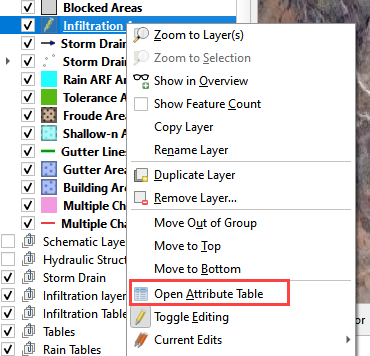

2. Click the Edit Pencil and start editing the data.
   Save and close the window.

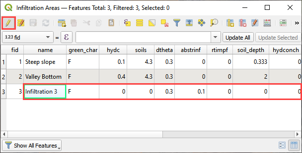

3. The data will  
   automatically update in the widget.

4. Click the Schematize  
   button to commit the changes to the grid.

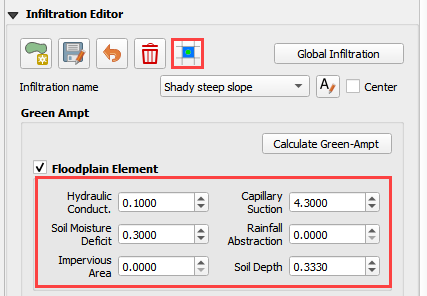

The infiltration polygons outline areas of cells that have similar infiltration characteristics.
In the following image, the infiltration areas are different for urban, desert and desert drainage.

.. image:: ../../img/Infiltration-Editor/Infilt009.png

Channel Infiltration
---------------------

1. To assign channel  
   infiltration, use the channel infiltration editor.

2. Set a global  
   hydraulic conductivity for all channel elements.

3. Click the Channel  
   Infiltration button.

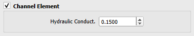

4. Local channel  
   infiltration is set by segment in the dialog box.

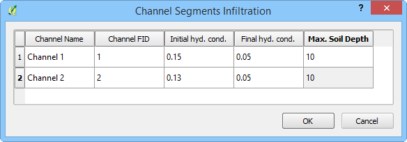

Green-Ampt Infiltration Calculator
-------------------------------------

To use the Green-Ampt calculator, the user must prepare soil and landuse shapefiles.
The soils data is acquired from the United States Department of Agriculture Web Soil Survey (USDA, 2017).
The data is organized by soil group.
The land use data can be acquired from various sources but is generally available from the United States Geological Survey Land Cover website (USGS,
2017).
The land use data can account for vegetative cover and impervious cover.

1. Prepare the data into  
   shapefiles using QGIS or import them into QGIS.

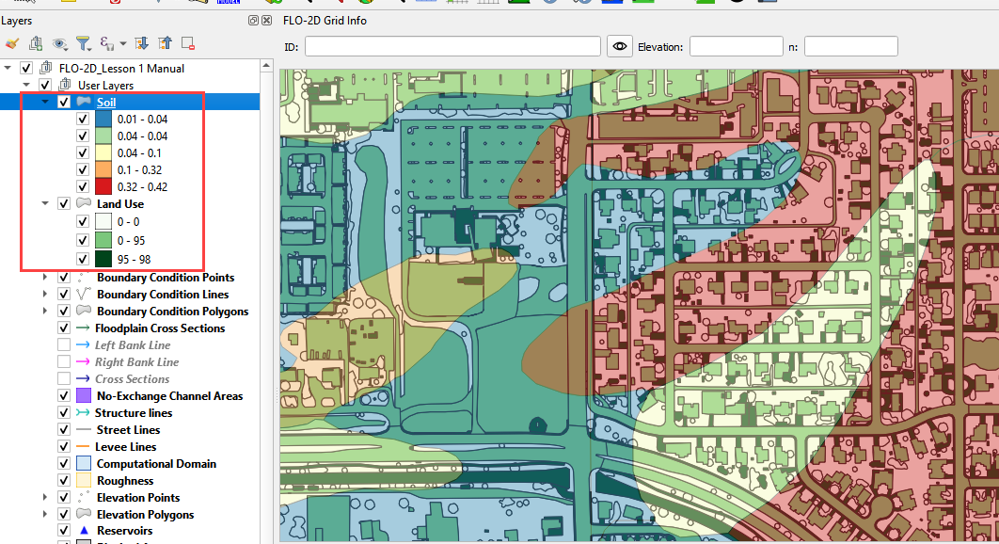

2. The infiltration  
   polygons need the attributes listed below.

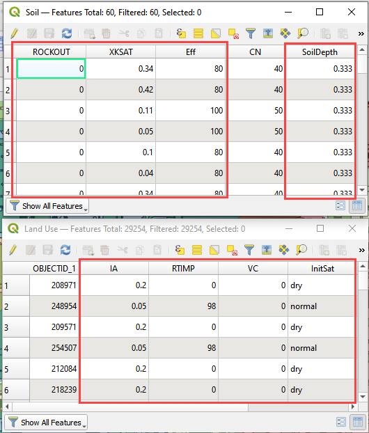

3. To run the calculator,  
   click the Calculate Green-Ampt button.

.. image:: ../../img/Infiltration-Editor/Infilt014.png

4. Fill the form and  
   click OK.

5. The Plugin will
   assign spatially variable infiltration data to each cell using an intersection and weighted average.

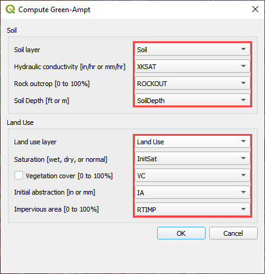

6. When the infiltration  
   calculator is finished, the following message will appear.

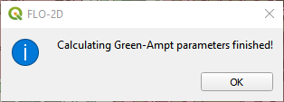

7. The INFIL.DAT file  
   looks like this.

.. image:: ../../img/Infiltration-Editor/Infilt017.png

SCS
---

Global Uniform Infiltration
----------------------------

The SCS infiltration editor can add global or spatially variable infiltration data to the INFIL.DAT file for infiltration curve numbers.

1. Set up the Global Infiltration first.
   Click Global Infiltration.

.. image:: ../../img/Infiltration-Editor/Infilt018.png

2. Fill the Global  
   Infiltration dialog box.

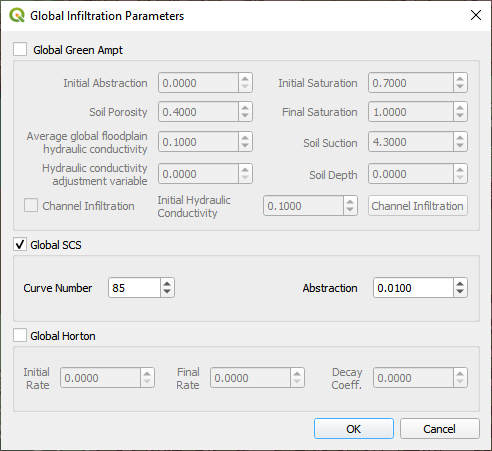

3. The INFIL.DAT file  
   looks like this:

4. Where the infiltration  
   type is 2 = SCS infiltration.

5. The 85 is the uniform curve  
   number for each grid.

6. The 0.01 is the initial  
   abstraction.

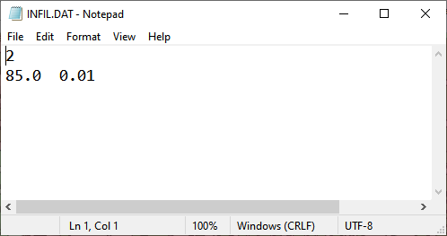

Spatial Infiltration from User Layer
------------------------------------

Spatially variable floodplain infiltration is set by digitizing infiltration polygons or importing infiltration polygons.
Use the polygon editor to digitize spatially variable infiltration.
Create a polygon to represent an area of infiltration.

1. Select the Infiltration  
   Areas user layer.

2. Click the editor pencil and  
   snapping magnet button.

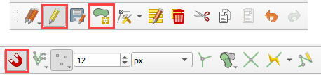

3. Create the polygons the  
   represent areas with the same curve number.

4. Fill the table for the  
   infiltration data.

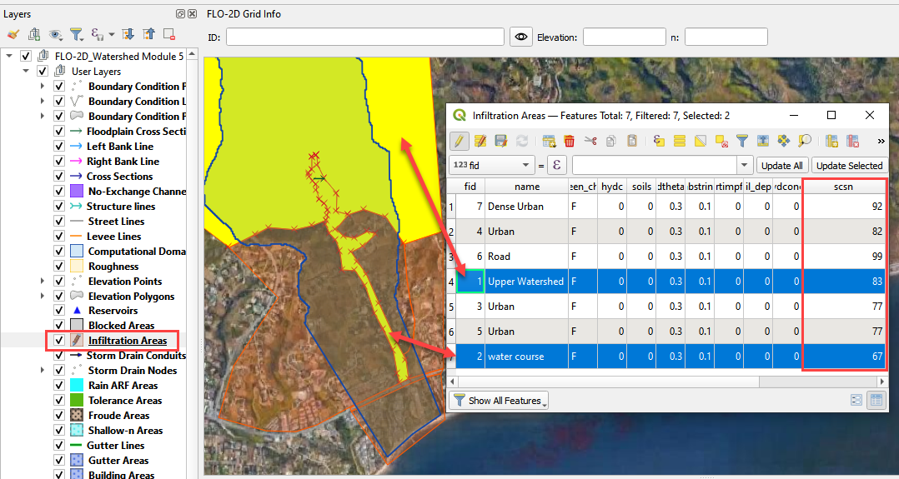

5. The finished table has a  
   CN for every polygon.

6. Click the Save button to  
   save the attributes.

7. Click the pencil button  
   to close the editor.

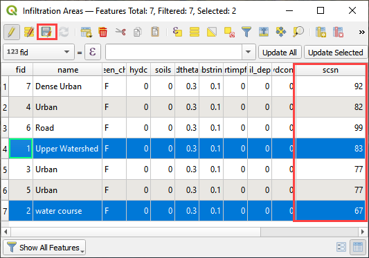

8. Check the data in the Infiltration Editor Widget.
   Click the Schematize button to complete the process.

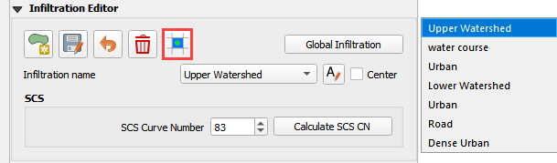

9. The spatially variable  
   INFIL.DAT looks like this:

.. image:: ../../img/Infiltration-Editor/Infilt025.png

SCS Calculator Single Shapefile
-------------------------------

This option will add spatially variable infiltration data to the grid from a shapefile with one CN attribute field.

1. Click the Calculate  
   SCS CN button.

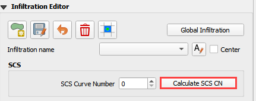

2. Select the layer and field  
   with the infiltration data and click OK to run the calculator.

3. This method works for  
   shapefiles that have a CN already calculated.

4. Click OK to calculate a  
   spatially variable CN value for every grid element.

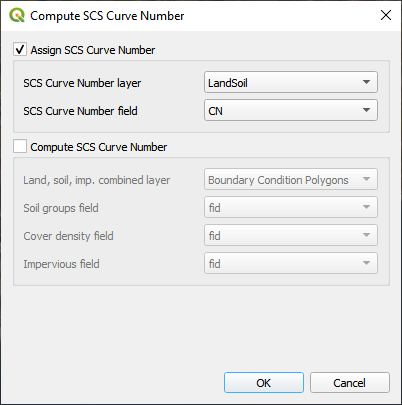

5. When the calculation is complete, the following box will appear.
   Click OK to close the box.

.. image:: ../../img/Infiltration-Editor/Infilt028.png

6. The INFIL.DAT file  
   looks like this.

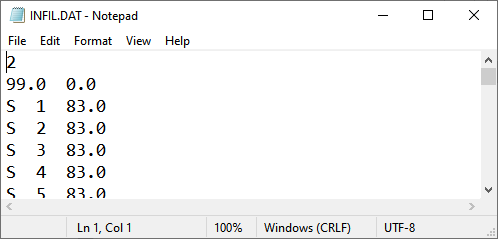

SCS Calculator Single Shapefile Multiple Fields
-----------------------------------------------

Use this option for Pima County to calculate SCS curve number data from a single layer with multiple fields.
This is a vector layer with polygon features and field to define the landuse/soil group, vegetation coverage and impervious space.
This option was developed specifically for Pima County.

The data should be arranged as shown in the attribute table.

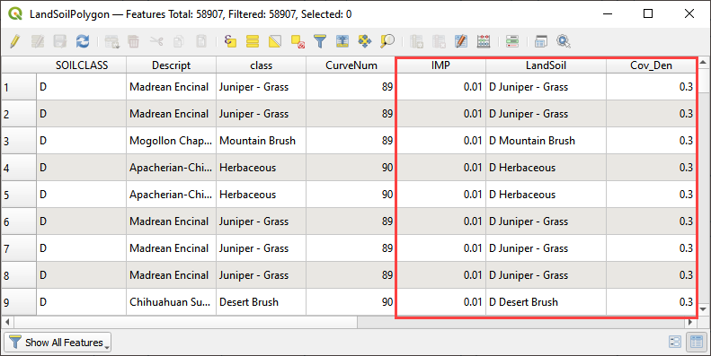

1. Click the  
   Calculate SCS CN button.

.. image:: ../../img/Infiltration-Editor/Infilt031.png

2. Select the layer  
   and fields with the infiltration data and click OK to run the calculator.

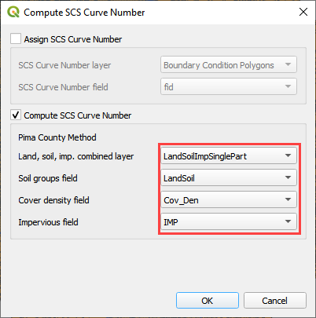

3. When the calculation is complete, the following box will appear.
   Click OK to close the box.

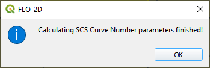

Horton
------

Global Uniform Infiltration
---------------------------

The Horton infiltration editor can add global or spatially variable infiltration data to the INFIL.DAT file for infiltration curve numbers.

1. Set up the Global Infiltration first.
   Click Global Infiltration.

.. image:: ../../img/Infiltration-Editor/Infilt018.png

2. Fill the Global  
   Infiltration dialog box.

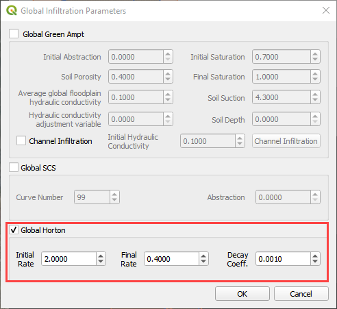

Uniform Horton infiltration is assigned as follows in the INFIL.DAT file:

.. image:: ../../img/Infiltration-Editor/Infilt035.png

Horton Spatially Variable Method
--------------------------------

Spatially variable Horton infiltration is created by digitizing infiltration polygons.
Use the polygon editor to digitize spatially variable infiltration.
Create a polygon to represent an area of infiltration.

1. Click the create a  
   polygon tool and digitize a polygon.

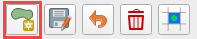

2. Click  
   Save.

.. image:: ../../img/Infiltration-Editor/Infilt037.png

3. Right Click the Infiltration Areas layer (User Layers) and open the Attributes Table.
   Click the Editor Pencil button.

4. Name the infiltration  
   polygons and fill out the data for fhorti, fhori, and deca.

5. Click the Save button  
   and Editor Pencil button.

6. Click  
   Schematize.

.. image:: ../../img/Infiltration-Editor/Infilt038.png

.. image:: ../../img/Infiltration-Editor/Infilt039.png

7. The spatially  
   variable Horton looks like this in the INFIL.DAT file.

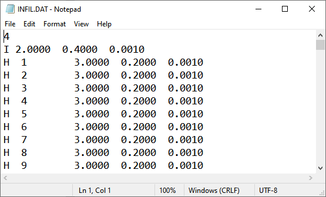

Troubleshooting
---------------

1. Infiltration calculators all use intersection tools.
   This can cause problems if the shapefiles are not set up correctly.
   Specifically, land use and soils shapefiles that may have been converted from raster data.
   If errors persist, use “fix geometry”, “simplify”, and “dissolve” on the source shapefiles.
   These tools are part of the QGIS Processing Toolbox.
   They can also be corrected in ArcGIS if the datasets are very large.

2. Make sure the shapefiles completely cover the grid.
   If a grid element is outside the coverage of the infiltration, QGIS will show an error.

3. Make sure the shapefile fields have a correctly defined number type.
   The shapefiles that are supplied with the QGIS Lessons will help define the Field Variable Format such as string, whole number or decimal number.
