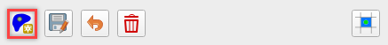
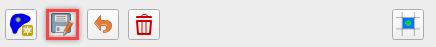
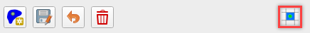
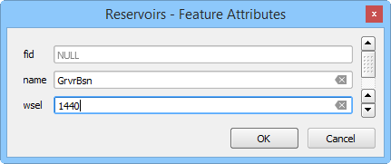
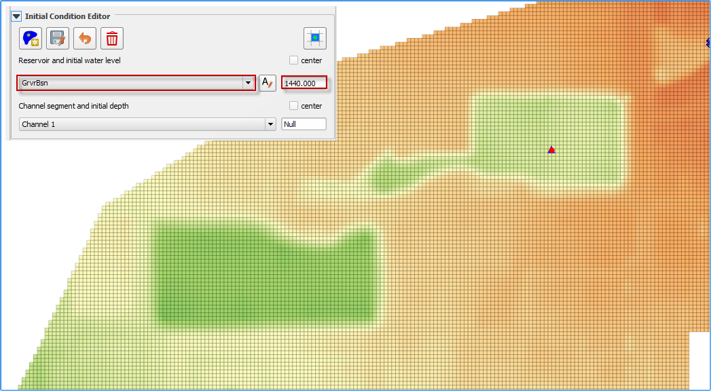
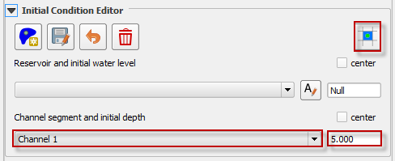

Initial Condition Editor
========================

Reservoir Node
--------------

The reservoir node is used to assign the water surface elevation for a reservoir or pond by specifying a single reservoir node elevation.
The FLO-2D model will identify every grid element as a reservoir element whose bed elevation is less than the prescribed water surface elevation at
runtime as assign the starting reservoir flow depth.
The reservoir data is written to the INFLOW.DAT file.

1. Click the
   Reservoir button.

2. Click a cell
   within the reservoir.

3. Set the
   name and elevation.

4. Click save to
   activate the form.

5. Click Schematize
   to save the data to the schematic layers.

 

 

Troubleshooting
---------------

The most common issue encountered with this tool is low reservoir bank elevation surrounding the reservoir.
If the confining reservoir bank element is lower than the reservoir elevation, the water will spill out of the cell.
Check the reservoir containment by running the FLO-2D simulation for short duration of 0.01 hours.
The reservoir will be filled and display any leaks in the maximum depth output files.

Channel Segment Initial Depth
-----------------------------

Use this option to set an initial depth in any channel segment.
The water depth will be assigned to every channel cross section within the segment at runtime.
The initial condition will be written to the CHANNEL.DAT file.

1. Select
   the channel segment.

2. Set the
   initial depth.

3. Click
   Schematize to save the data to the schematic layers.

Troubleshooting
---------------

The simplicity of this tool makes it simple to adjust.
It is not necessary to use the tool here because the variable can also be set in the Schematized Channels Editor.
