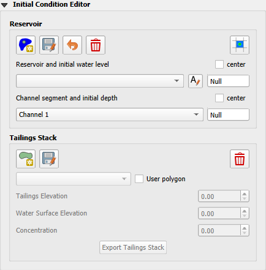
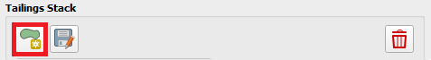
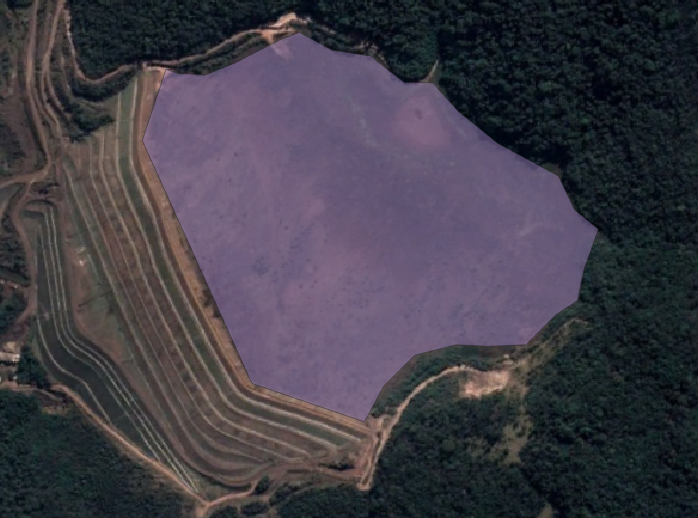
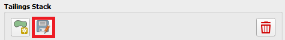
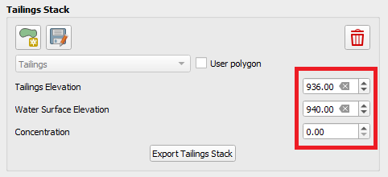
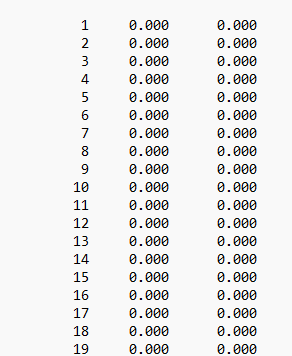

Initial Condition Editor
========================

The Initial Condition Editor is used to set the FLO-2D Initial conditions. This editor is user to set the following
initial conditions:

- Reservoirs
- Channel Initial Depth
- Tailings Stack

Reservoir Node
--------------

The reservoir node is used to assign the water surface elevation for a reservoir or pond by specifying a single reservoir node elevation.
The FLO-2D model will identify every grid element as a reservoir element whose bed elevation is less than the prescribed water surface elevation at
runtime as assign the starting reservoir flow depth.
The reservoir data is written to the INFLOW.DAT file.

1. Click the
   Reservoir button.

.. image:: ../../img/Buttons/resevoir.png

2. Click a cell
   within the reservoir.

3. Set the
   name and elevation.

4. Click save to
   activate the form.

.. image:: ../../img/Initial-Condition-Editor/Initia003.png

5. Click Schematize
   to save the data to the schematic layers.

.. image:: ../../img/Initial-Condition-Editor/Initia004.png

.. image:: ../../img/Initial-Condition-Editor/Initia005.png
 

.. image:: ../../img/Initial-Condition-Editor/Initia006.png
 

Troubleshooting
---------------

The most common issue encountered with this tool is low reservoir bank elevation surrounding the reservoir.
If the confining reservoir bank element is lower than the reservoir elevation, the water will spill out of the cell.
Check the reservoir containment by running the FLO-2D simulation for short duration of 0.01 hours.
The reservoir will be filled and display any leaks in the maximum depth output files.

Channel Segment Initial Depth
-----------------------------

Use this option to set an initial depth in any channel segment.
The water depth will be assigned to every channel cross section within the segment at runtime.
The initial condition will be written to the CHANNEL.DAT file.

.. image:: ../../img/Initial-Condition-Editor/Initia007.png

1. Select
   the channel segment.

2. Set the
   initial depth.

3. Click
   Schematize to save the data to the schematic layers.

.. image:: ../../img/Initial-Condition-Editor/Initia004.png

Troubleshooting
---------------

The simplicity of this tool makes it simple to adjust.
It is not necessary to use the tool here because the variable can also be set in the Schematized Channels Editor.

Tailings Stack
--------------

A collapse of the tailing's facility can be simulated without using the prescribed breach failure data in the LEVEE.DAT file.
This is accomplished by assigning tailings depths to the grid elements within tailings facility.
The main purpose of this tool is to create the TAILINGS_STACK_DEPTH.DAT file.
The TAILINGS_STACK_DEPTH.DAT file is used when you have an original foundation topo and a tailings surface elevation (design or existing) and you want to automatically generate a stack collapse failure.
This file is a .DAT files that contains the grid element, depth of water, and depth of tailings.
When the FLO-2D model is run with the levee dam cells removed, the storage tailings begin to move immediately.

1.  Click the Add Tailings button.

2.  Draw the Tailings area.

3.  Save the Tailings area.

4.  It is possible to use a user shapefile by checking the User Polygon checkbox.

5.  Set the Tailings Elevation (Mudflow only), Water Surface Elevation (Two-phase), and Concentration.

6.  Click on Export Tailings Stack to generate the TAILINGS_STACK_DEPTH.DAT file.

Troubleshooting
---------------

Check if the TAILINGS_STACK_DEPTH.DAT file is located in the same folder as the other .DAT files prior running FLO-2D Pro.
INFLOW.DAT is not required and make sure to turn off LEVEE on CONT.DAT.

