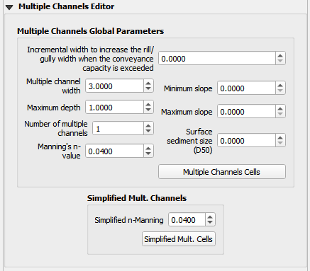
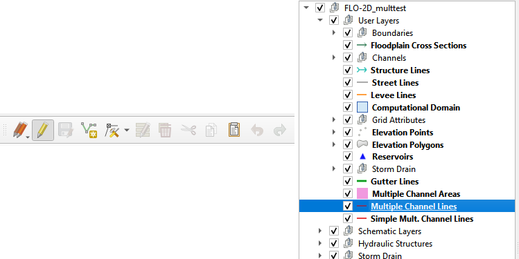
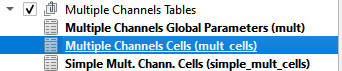
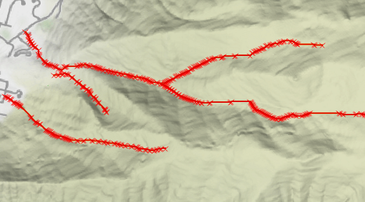
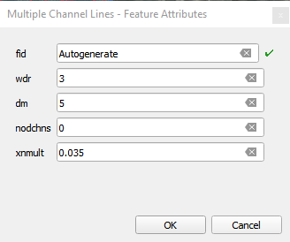
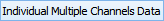
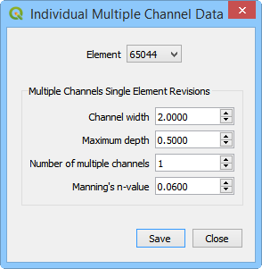
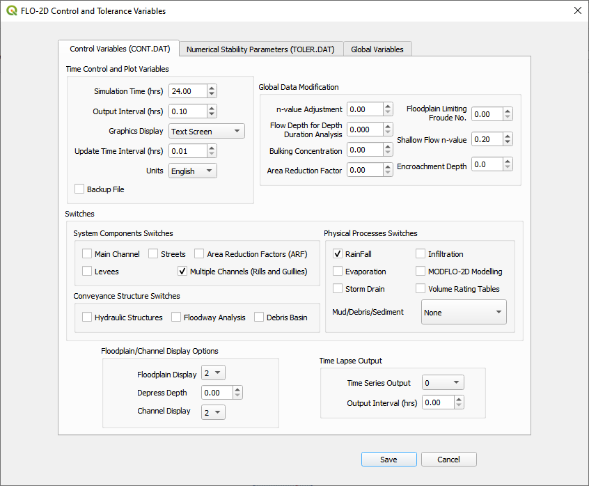

Multiple Channels Editor
========================

The multiple channel editor is used to set up the global parameters for the MULT.DAT file.

Multiple Channel Lines
----------------------

The Multiple Channel Lines layer is used to set the path of the multiple channels.
This layer is in the Schematic Layer group.
Enter the data using the QGIS vector editor in the toolbar.

1. Digitize the drainages,
   rills or gullies in the project area.

2. Assign the spatially variable data to each line.
   The multiple channel lines are split into segments wherever a new channel begins or ends or when new data is required.

 

3. Save and close the editor to commit the data to the geopackage.
   This will automatically write the data to the Multiple Tables and assign the grid elements.
   It also enables the Individual Multiple Channel Data button.

Individual cells can be edited with this dialog box.

If multiple layer edits are required, they should be made in the Multiple Channel Line layer.

Multiple Channel Areas
----------------------

When a channel is imported into QGIS using the Import FLO-2D Component button, the data is written to the Multiple Channel Areas layer as grid element sized
polygons.

Export MULT.DAT Files
----------------------

To export the MULT.DAT file, check the Multiple Channel checkbox and click save.
The MULT.DAT file will be written the next time the project data is exported.

