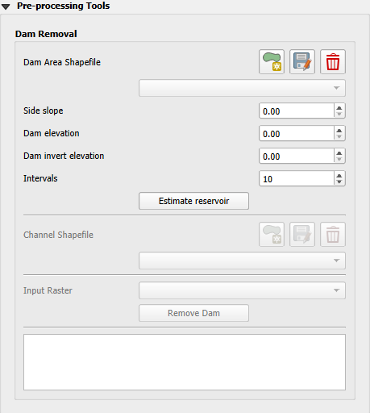
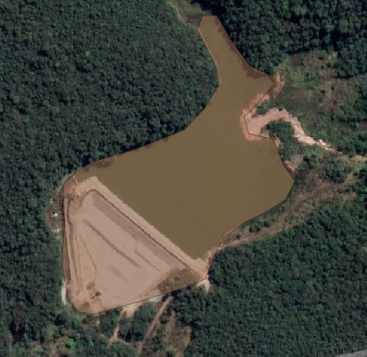
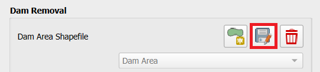
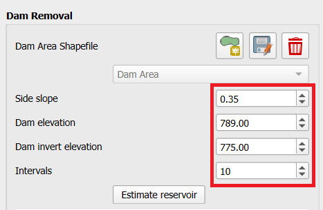
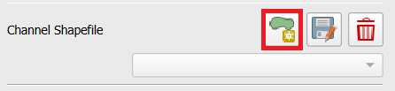
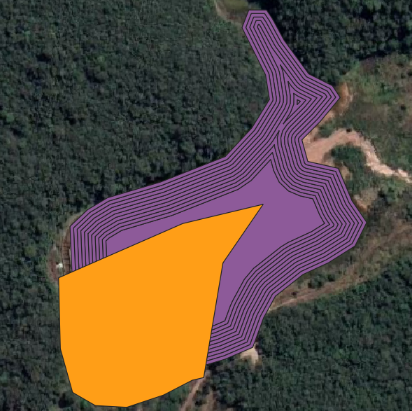
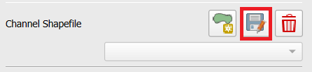
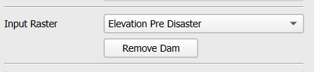
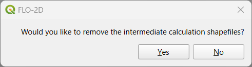

Pre-Processing Tools
========================

The Pre-Processing Tools is a set of tools designed to modify Digital Elevation Models (DEMs) for various applications.
These tools provide efficient pre-processing solutions for removing artificial barriers such as dams, bridges, and
levees, allowing users to create more realistic and valuable terrain representations.

.. note:: To date, the only available tool is the Dam Removal.
          Bridge & Levee removal tools are expected in future updates.

Dam removal
------------

The Dam Removal Tool is a specialized utility designed to process Digital Elevation Models (DEMs) and remove the
representation of dams or artificial barriers within the elevation data.

1.  Click on Dam area.

.. image:: ../../img/Pre-Processing-Tools/Prepro001.png

2.  Draw the dam area

3.  Click on Save dam area to save the shapefile.

4.  Fill the Side slope, Dam elevation, Dam invert elevation, and Intervals.

5.  Click on Estimate Reservoir.

.. image:: ../../img/Pre-Processing-Tools/Prepro005.png

6.  Click on Add Channel.

7.  Draw the channel.

8.  Click on Save channel.

8. Select the Input Raster.

9.  Click on Remove Dam and save or not the intermediate calculation shapefiles (Dam Area & Channel).

10. Check the modified DEM for any bad data and redo the process until the DEM is satisfactory.

.. image:: ../../img/Pre-Processing-Tools/Prepro011.png

Troubleshooting
---------------

Estimate the side slopes based on the dam banks or design data.
The connection between the channel and the reservoir is usually steep, check for potential bad data there.
Check the area and the volume removed from the DEM to match the design volume.
The number of intervals equal 10 is a good estimation, but it can be modified.
