Rain Editor
===========

Rainfall
--------

The rainfall editor is used to set up the RAINFALL.DAT file and the RAINCELL.DAT file.
This section will describe how to set up uniform rainfall, spatially variable depth area reduction factors, and spatially and time variable rainfall.

Uniform Rainfall
----------------

Uniform rainfall requires the total rain in inches or millimeters and a rainfall distribution.
In this example, the total rainfall is 3 inches.
To find Total Storm Rainfall, zoom to Rainfall raster with Computational Domain layer, check Identify Features button, clicks within the Computational
Domain to find highest derived value.
The Building Rain switch is selected so that rain on totally blocked ARF cells will allow rain to run from the blocked areas.
The initial abstraction is default of zero inches.
The rainfall distribution is imported from a data file.

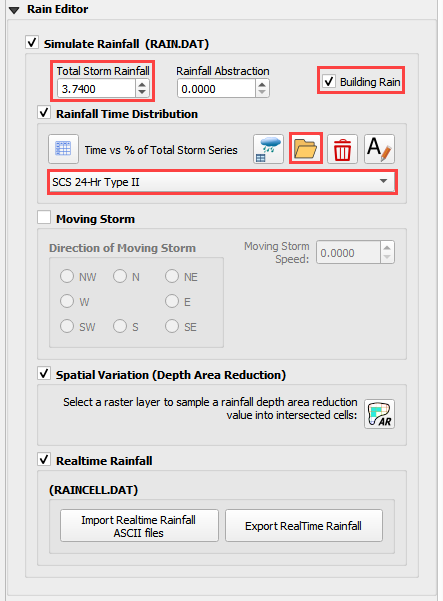

1. Select the rainfall
   distribution using the Folder menu.

2. Import the rainfall distribution file from a set of predefined files. The files
   are installed in the FLO-2D Documentation folder.

**C:\users\public\publicdocuments\FLO-2D Pro Documentation\flo_help\Rainfall Distributions**

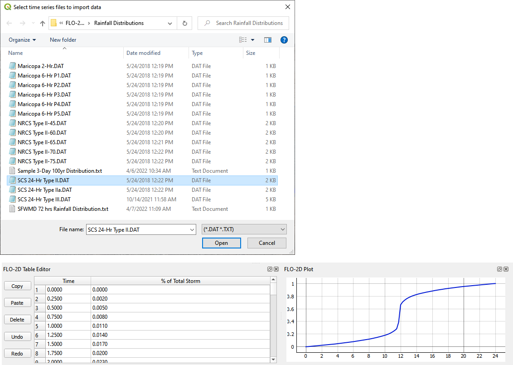

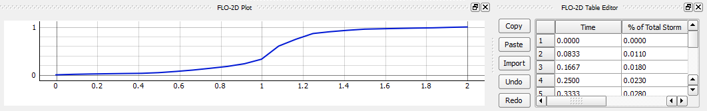

The rainfall data is imported into the FLO-2D Table Editor.

1. Load the currently selected time series into the editor
   table.

2. Add a new
   rainfall time series to the project.

3. Open a time
   series data file.

4. Delete a time
   series table.

5. Rename a time
   series data set.

Moving Storm
-------------

To simulate a moving storm cell, select a storm direction and speed.
This data must be assigned along with isohyetal contours that represent storm intensity as depth are reductions contours.

.. image:: ../../img/Rain-Editor/rained006.png

Spatially Variable Rainfall NOAA Atlas 14
------------------------------------------

Spatially variable rainfall data can be set up using depth area reduction factors in the RAINFALL.DAT file.
The data format is inches (millimeters) at a point over total rainfall in inches (millimeters).
The point is the centroid of each cell.
The total rainfall area is the computational domain.

The rainfall data is obtained from precipitation rasters.
In the United States the rasters are calculated from isohyetal contours located the NOAA precipitation prediction website (NOAA, 2017).
One map is required for each precipitation frequency.
The following example is a map of the 100yr 6hr storm prediction for Arizona.
The legend represents total rainfall in inches.

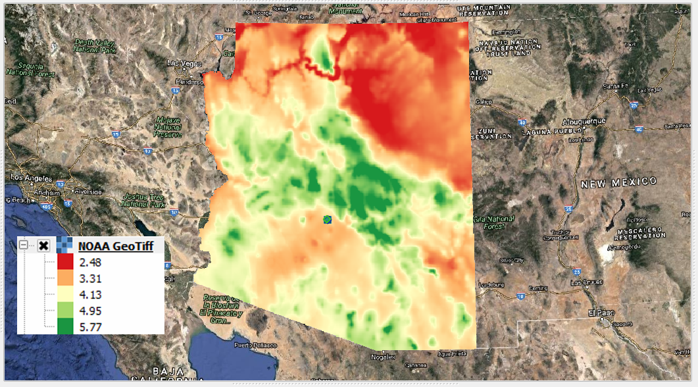

To perform the calculation, use the Area Reduction calculator.

|rained024|\ |rained025|

1. Click the
   Area Reduction button.

2. Fill the
   form and click OK.

The raster pixels are typically 1000 by 1000 ft or larger.
It is not necessary to average the data.

3. Select the maximum value to set the cell value.

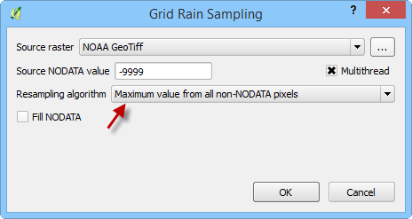

Realtime Rainfall NEXRAD
------------------------

Realtime rainfall data is computed from NEXRAD \*.ASC grid files.
In the United States, the files are derived from calibrated radar reflectivity maps from National Oceanic and Atmospheric Administration (NOAA) and
rainfall gages in local areas.
The data calibration is typically conducted by local agencies or consultants.
Datasets can be downloaded directly from NOAA’s NEXRAD Archive (NOAA, 2017).
NEXRAD rainfall data and rainfall gage data are available from NOAA.

The realtime rainfall calculator imports the \*.ASC files, interpolates them to the grid and creates the rainfall data in two formats.
The formats are RAINCELL.DAT and RAINCELL.HD5.

**Important Note**

**The RAINCELL.DAT file is a mega data file.
It is not recommended to import this file into a QGIS – FLO-2D project when importing FLO-2D Data files.
It is recommended to use a Skeleton Project with only grid data and no other components loaded to perform the RAINCELL.DAT or RAINCELL.HDF5 data
files.**

Rainfall Catalog
----------------

The project directory must contain all the rainfall \*.asc files and a catalog file \*.rtc.
Both filetypes are text files.
The \*.asc files are rainfall coverage for the project area at a specified time interval.
In this case the time interval is 5 minutes.

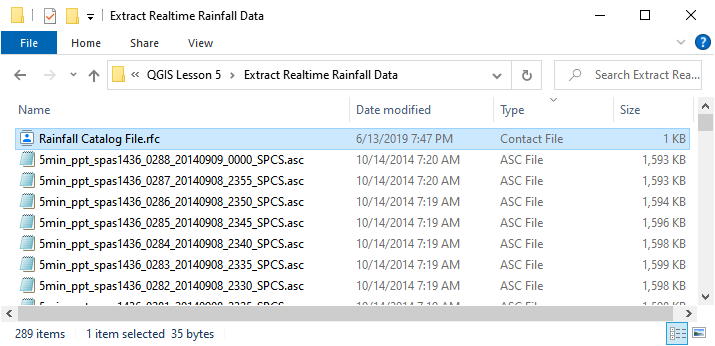

The rainfall catalog is a text file that contains specific information about the layout and timing of the data.
The first line of data is a control line that sets up the timing of the storm and the interval.

Line 1: 9/9/2013 04:05 9/9/2013 23:55 5 239

Line 1: Start Time, End Time, Time Interval, \*.asc File Count

**Important Note**

**Line 2 of the \*.rfc isn’t necessary.
The Rainfall calculator will use all \*.ASC files in the project directory.
Make sure they are named in ascending order by time.**

**Time = 0 is not necessary.
The engine will start the simulation at time and rainfall = zero.
The rainfall data will interpolate from time = 0 rainfall = 0 to the first interval.**

.. image:: ../../img/Rain-Editor/rained010.png

.. image:: ../../img/Rain-Editor/rained011.png

Setup Import Options
--------------------

The rainfall data does not have a specific coordinate reference system (CRS).

1. Set the import options for QGIS to automatically assign all imported data with no knows CRS to the Project CRS.

2. Click Settings Options

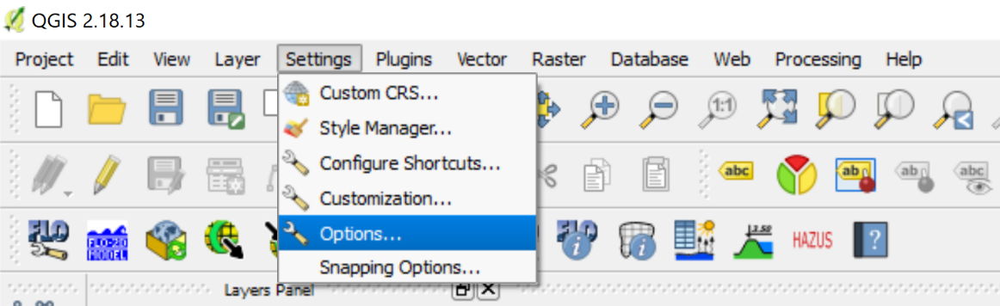

3. Select the following options and click OK.

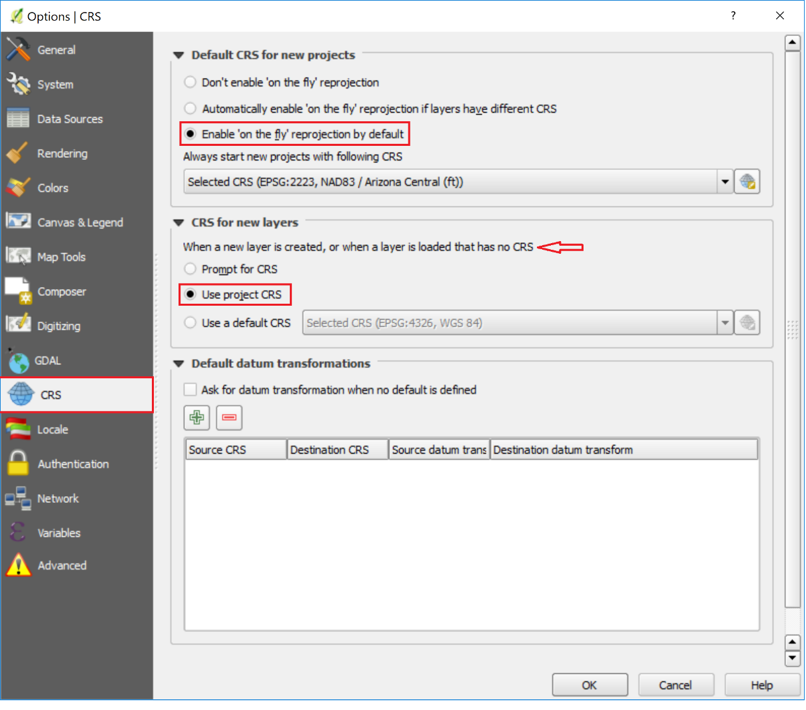

Import Realtime Rainfall
------------------------

1. To interpolate realtime rainfall data, activate the Realtime Rainfall Editor.

2. Click the Import Real Time Rainfall ASCII files.

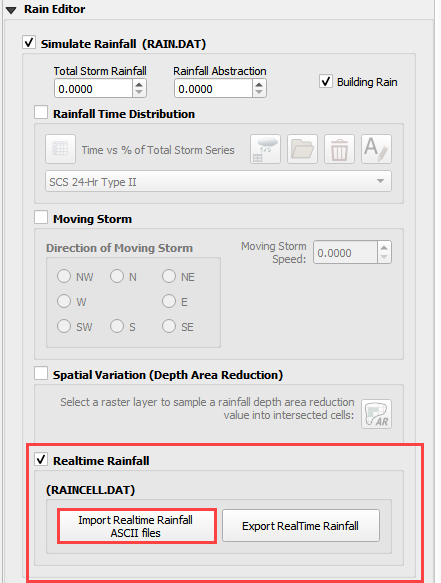

The Plugin requests the directory where the NEXRAD data is stored.

3. Navigate to the correct directory and click Select Folder.

.. image:: ../../img/Rain-Editor/rained015.png
  

4. Click OK once the process is complete.

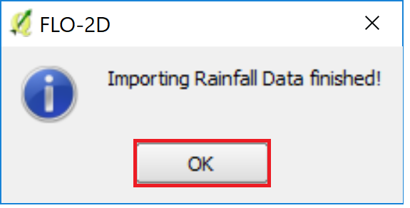

Export the rainfall data.
-------------------------

1. Click Export the Rainfall Data

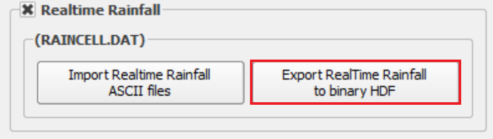
  
2. Name the storm and click Save.

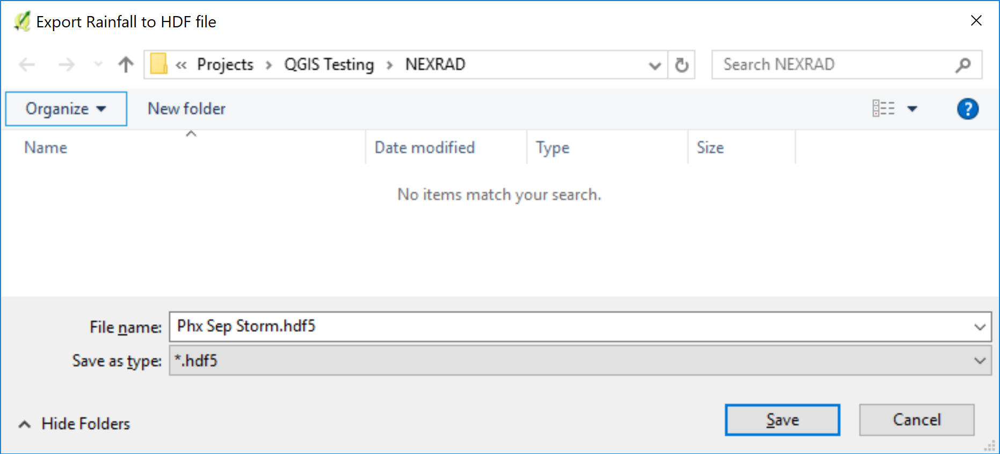

 

.. |rained025| image:: ../../img/Rain-Editor/rained025.png

