Storm Drain Editor
==================

The Storm Drain Editor tool has several functions to prepare the data that integrates the FLO-2D surface water model with the storm drain model.
This document will explain the functionality of each button.
For a step-by-step tutorial, use the QGIS Workshop Lessons or the Self-Help training package.

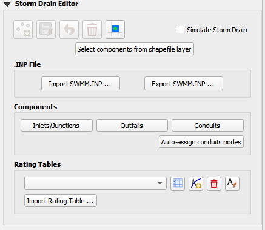

1. The digitize storm drain buttons are inactive.
   It is recommended to create a storm drain network in separate storm drain shapefiles as discussed below.

2. The blue schematize button
   is used when the storm drain system is complete and ready to convert to the FLO-2D schema layers.

3. The simulate storm drain
   check box will turn on the storm drain switch in the Control Variables.

.. image:: ../../img/Storm-Drain/Storm003.png

Storm Drain Network
-------------------

The select component from shapefile feature is used to build a storm drain network from a set of shapefiles.
Some projects have a storm drain system already developed.
Some projects have no network and start from scratch.
Either way, this information will serve as a template for the data needed to create a storm drain system.

1. Load the shapefiles
   onto the map or digitize new shapefiles with QGIS.

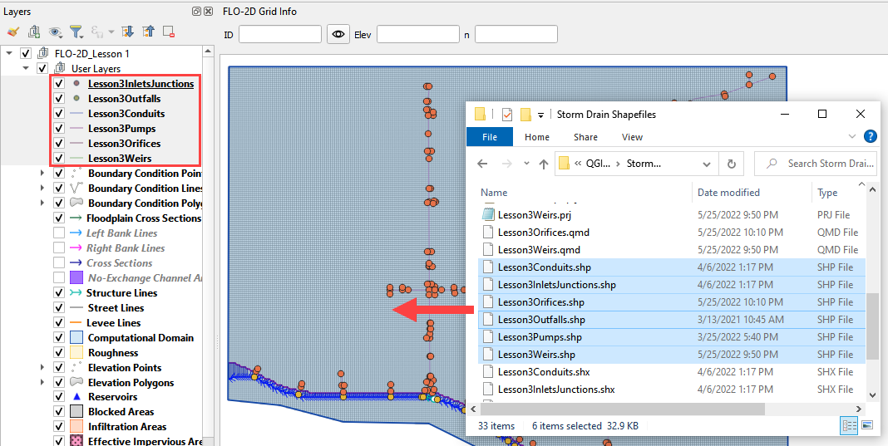

The shapefiles can be described as follow:

-  Lesson3Outfalls.shp is a point shapefile that contains the outfalls.

-  Lesson3Conduits.shp is a line shapefile that contains the conduits system.

-  Lesson3InletsJunctions.shp is a point shapefile that contains the Inlets, pumps, and Junctions.

The following data must be available in the shapefile to create the SWMM.INP files and the associated storm drain data files: SWMMFLO.DAT,
SWMMOUTF.DAT and SWMMFLORT.DAT.

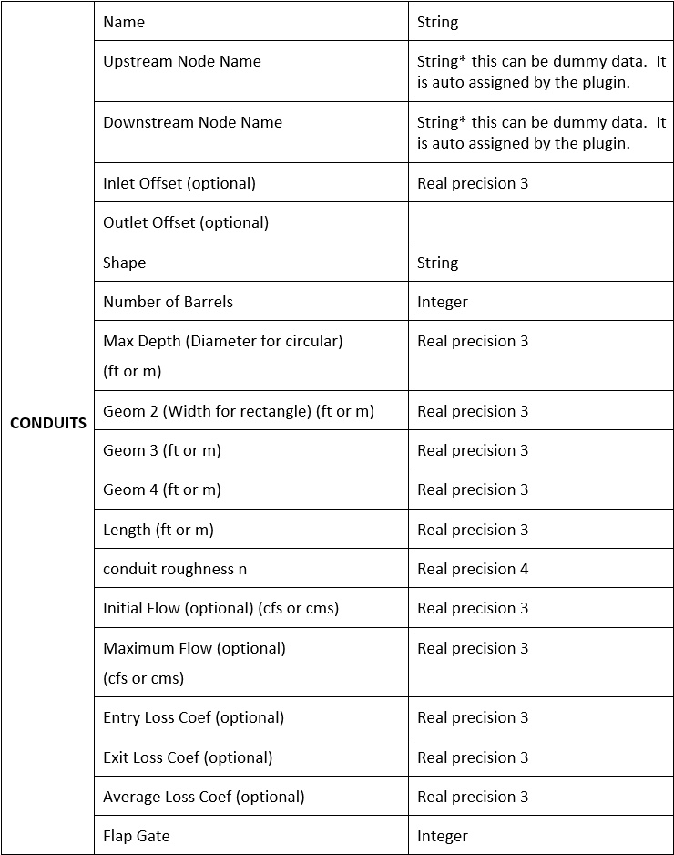

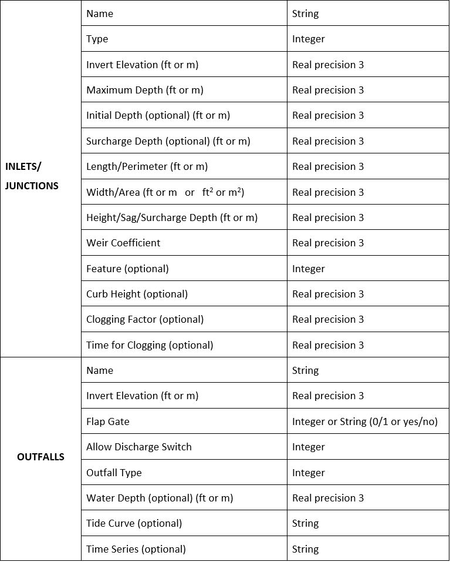

Inlets/Junctions Shapefile
--------------------------

This is a sample of the attributes table for the Inlet/Junctions shapefile.

.. image:: ../../img/Storm-Drain/Storm007.png

The fields from the attribute table are selected using the Select Components from Shapefile dialog box.

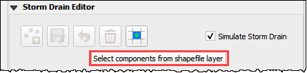

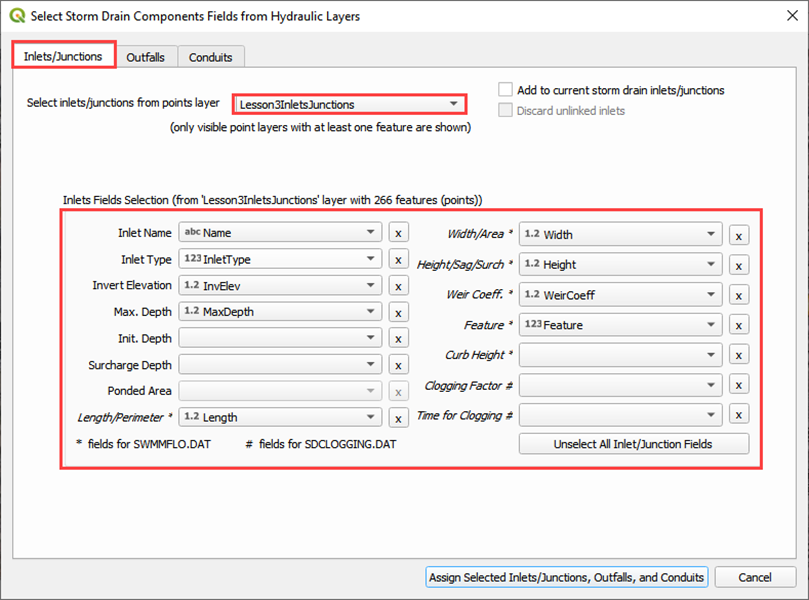

Conduits Shapefiles
-------------------

This is a sample of the attributes table for the conduit shapefile.

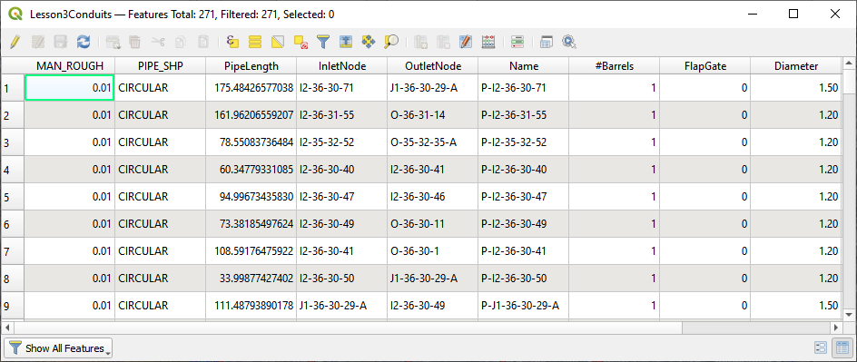

The fields from the attribute table are selected using the Select Components from Shapefile dialog box.

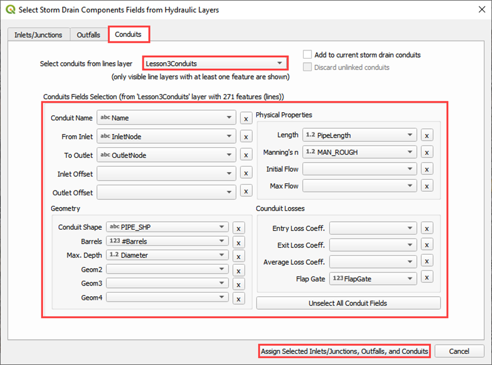

Outfall Shapefiles
------------------

This is a sample of the attributes table for the outfall shapefile.

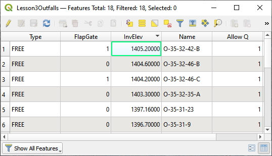

The fields from the attribute table are selected using the Select Components from Shapefile dialog box.

.. image:: ../../img/Storm-Drain/Storm013.png

Import SWMM.inp
---------------

1. An existing SWMM.inp project can be imported in a FLO-2D Surface System.

2. Click on Import SWMM.inp and browse the project folder that contains the file.

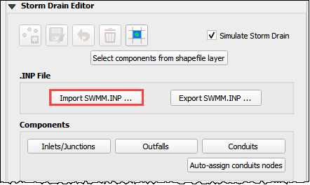

This button loads inlets/junctions, outfalls and conduits from an \*.INP file.
The Storm Drain data needs to be schematized; the table components that can be opened from the Storm Drain Editor will contain the variables from the
SWMM.inp file.
Additional data is needed for the SWMMFLO.DAT, SWMMOUTF.DAT and SWMMFLORT.DAT files.

QGIS FLO-2D layers will be filled up with the data from the following \*.INP groups:

-  Inlets/Junctions

-  Outfalls

-  Conduits

-  Cross sections

-  Losses

-  Coordinates (required coordinates only)

Export SWMM.inp
---------------

Export SWMM.inp file in a FLO-2D format prior to running.
The SWMM.INP can be created from shapefiles and then exported or it might be modified from an existing SWMM.INP.

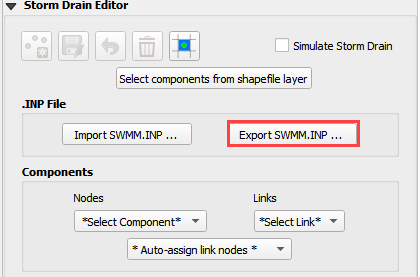

Data save in the Components tables is written to the .INP file using this function.

Components: Inlets/Junctions
----------------------------

Edit components that already exist using the Components editors for Inlets/Junctions, Outfalls and Conduits.

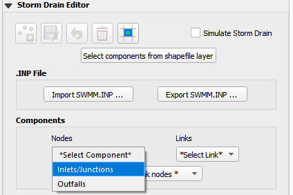

A dialog is shown with data for the selected component, in this case the Inlets/Junctions were selected, the user can edit the tables.

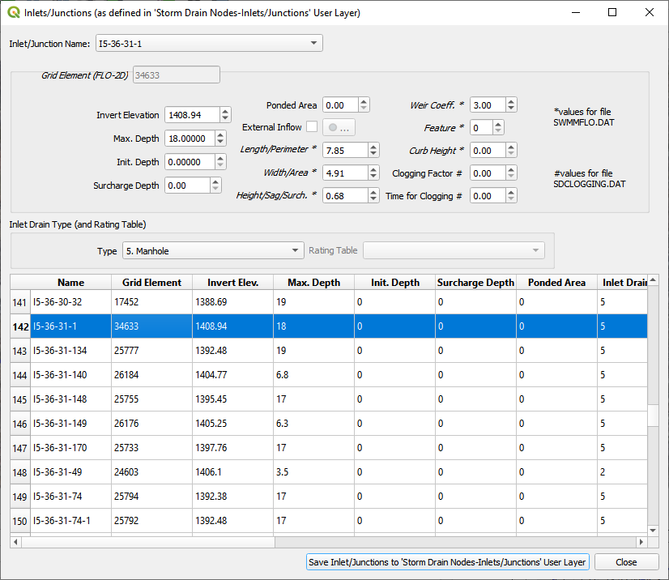

Components: Outfalls
--------------------

Edit components that already exist using the Components editors for Inlets/Junctions, Outfalls and Conduits.

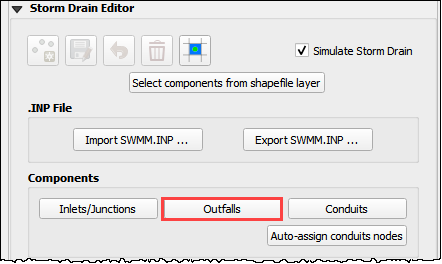

A dialog is shown with data for the selected component, in this case the Outfalls were selected, the user can edit the tables.

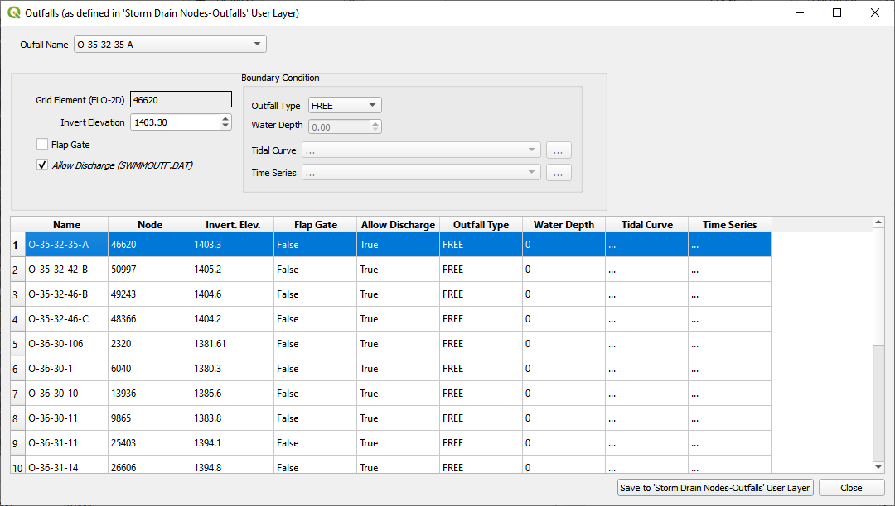

Components: Conduits
--------------------

Edit components that already exist using the Components editors for Inlets/Junctions, Outfalls and Conduits.

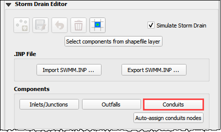

A dialog is shown with data for the selected component, in this case the Outfalls were selected, the user can edit the tables.

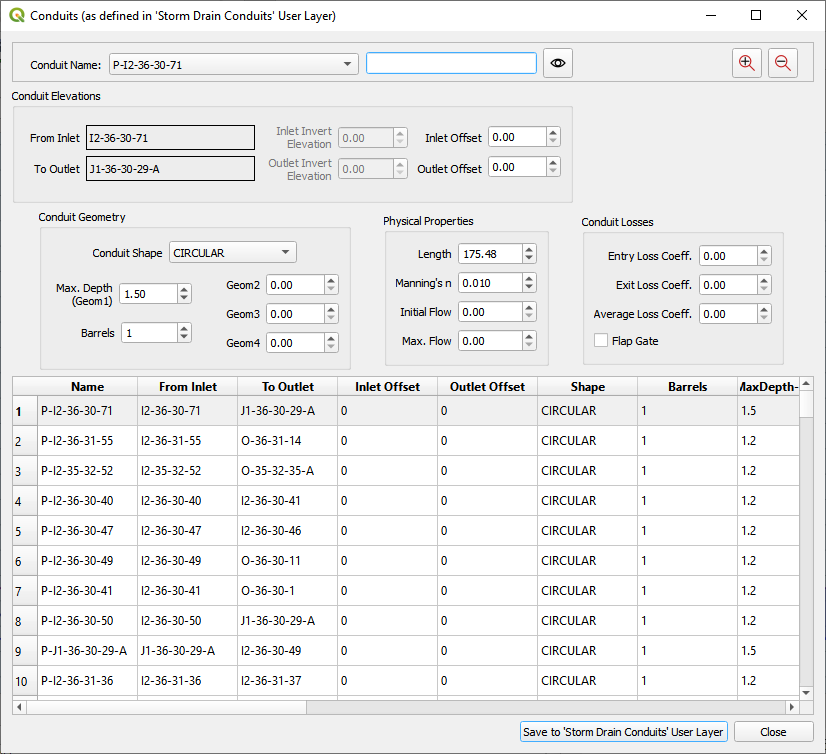

Auto-assign conduit nodes
-------------------------

This tool will automatically fill the node names required for the conduit connections.

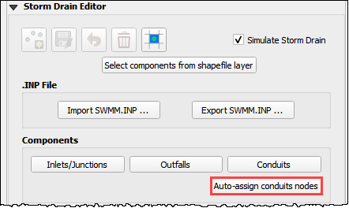

Conduits are connected to the node they touch both upstream and downstream by the name of the node.

.. image:: ../../img/Storm-Drain/Storm023.png

In a storm drain network there is a separate conduit feature between each node.
The auto-assign button finds the node in proximity of the end of each feature and assigns it to the table.
It is important to orient the conduit features so that the first vertex is near the inlet node and the last vertex is near the outlet node.
See the flow direction arrows in the following image.

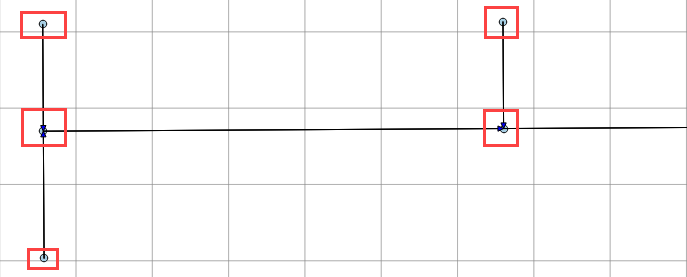

Rating Tables
-------------

Rating tables define the flow at a given depth.
They are used for headwalls.
There are two methods for building rating tables.
`Method 1 <#method-1.-create-with-the-flo-2d-plugin>`__ uses the Plugin to build the tables.
This method is good if only a few tables are required.
`Method 2 <#method-2.-import-multiple-tables>`__ imports tables from a text file.
This method is better if many tables are required.

Method 1. Create with the FLO-2D Plugin
----------------------------------------

1. Set up the rating
   tables with the Plugin by adding a rating table to the table editor and assigning the table to the correct inlet.

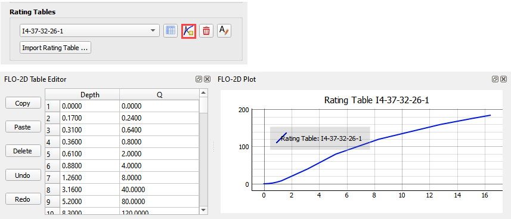

2. Use the Inlet Editor to
   assign the table to the Type 4 inlet.

.. image:: ../../img/Storm-Drain/Storm026.png

Method 2. Import multiple tables
------------------------------------

1. Click the
   Import Rating Table… button.

.. image:: ../../img/Storm-Drain/Storm027.png

2. Select all of the rating
   tables that match the type 4 inlets.

3. The Plugin will load the tables
   based on the node name and automatically assign each table.

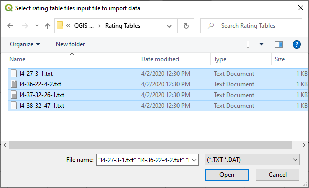

4. Tables are space or tab delimited
   and are created using culvert equations or HY-8.

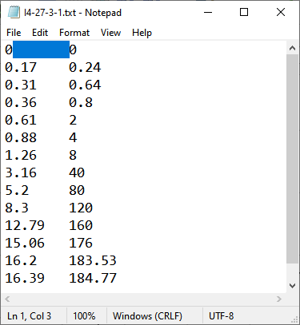

External Inflow Data
--------------------

1. Set up the external inflow data for a storm drain node.

2. Use the Inlet/Junction editor to set up external inflow parameters and data.

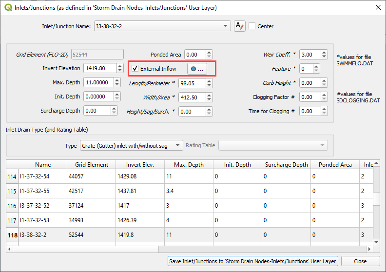

3. Use the Internal Inflow tools to define parameters and select time series data.

Simple parameters are used in this case.

-  Inflow constituent: water only (no pollutants)

-  Baseline flow: 0 cfs(cms)

-  Baseline pattern: hourly with no multiplier

-  Scale factor: none

-  Time series file: Example Project/QGIS Lesson 3/SDInflow.dat

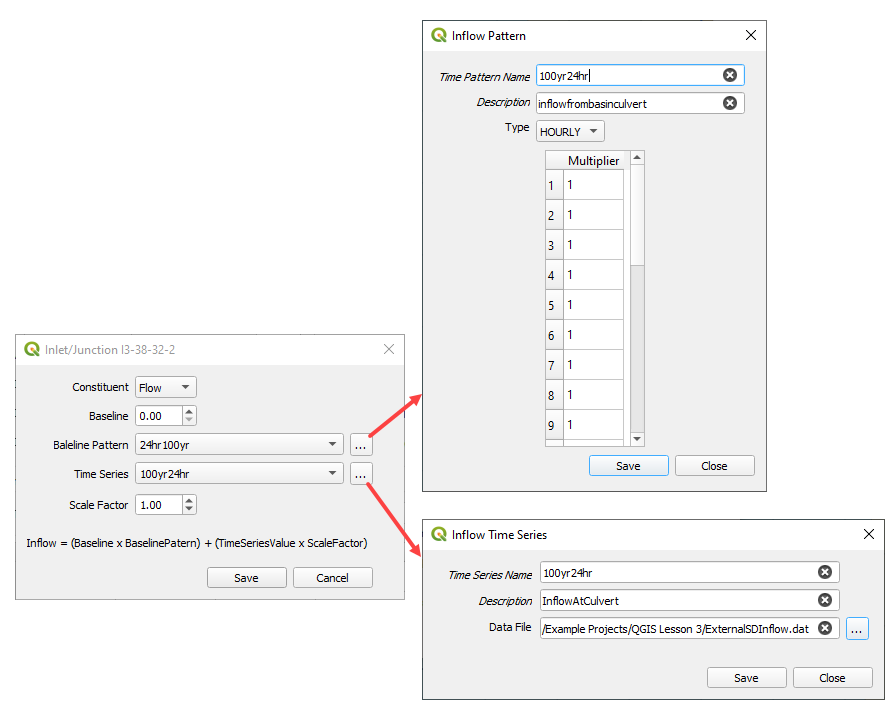
