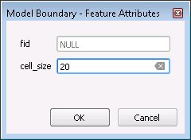

Working With the Plugin
=======================

In the example below, it is assumed that user is generating a hydraulic model from scratch. First step to build a model, is to create fresh database, where all the model files will reside.

Creating a new database
-------------------
To create a new database:

* In QGIS, from the main menu **Plugins > Flo2D > Settings**
* A new window will appear:

	* Click on **Create**
	* In the new window, type in your database name and hit **OK**
	* Select the projection in the next window
	* Set the default **Grid cell size** and the **Manning's n**

* Click **OK**

There should be new groups, subgroups and layers added to your QGIS layer tree.

The main sub-groups we will be interested in during the model build are:

* User Layers
* Schematic Layers

**User Layers** group consists of FLO-2D building blocks. Users can digitise, add and edit GIS and tabular data through these layers and tables. Once the data are prepared, there will be a function to assign or modify the underlying grid cells based on the inputs.

**Schematic Layers** are the processed information from the User Layers expressed in grid format and ready to be used in a FLO-2D simulation.

In the following sections, we will add various model elements and assign appropriate values.

Creating a new domain
-------------------

To create a new domain, you need to digitize a new polygon within the **Model Boundary** under **User Layers** group.

Digitizing and editing functions are carried out using the QGIS digitizing tools. For more information, how to use QGIS digitizing tools, `see <https://docs.qgis.org/2.14/en/docs/user_manual/working_with_vector/editing_geometry_attributes.html>`_

To add a Model Boundary:

* Right-click on the **Model Boundary** under **User Layers** in the layer tree and select https://docs.qgis.org/2.2/en/_images/mActionToggleEditing.png **Toggle Editing**
* From the Digitizing toolbar, click on https://docs.qgis.org/2.2/en/_images/mActionCapturePolygon.png
* Digitize the extent of the boundary and right-click to finish the polygon
* Once finished with the digitizing, the attribute table will appear:

	* Under **cell_size** type the appropriate cell size
	

Import GDS ASCII Files (Optional)
---------------------------------

Users can import model data created in GDS.

Create or Modify Model Data
---------------------------

Create new model from scratch using plugin tools and/or modify existing model data.
Various tools help to view/inspect model data.

Export GDS ASCII Files
----------------------

Once the model data is defined, users can export it to ASCII files read by the solver or GDS.